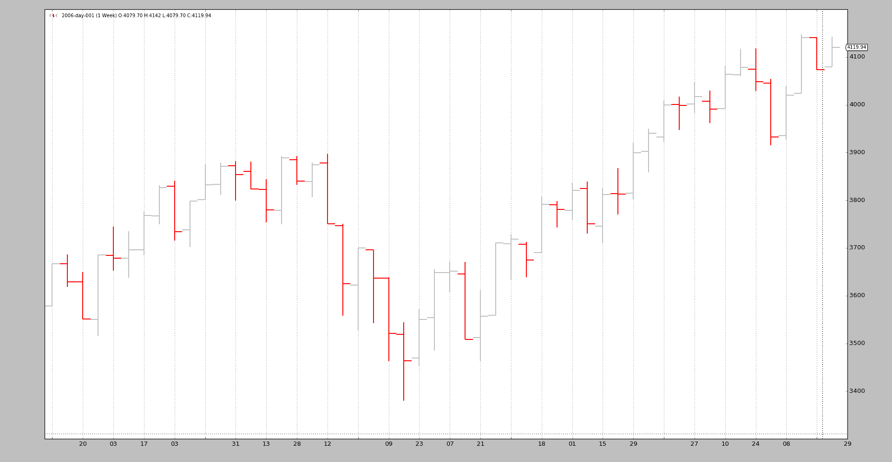
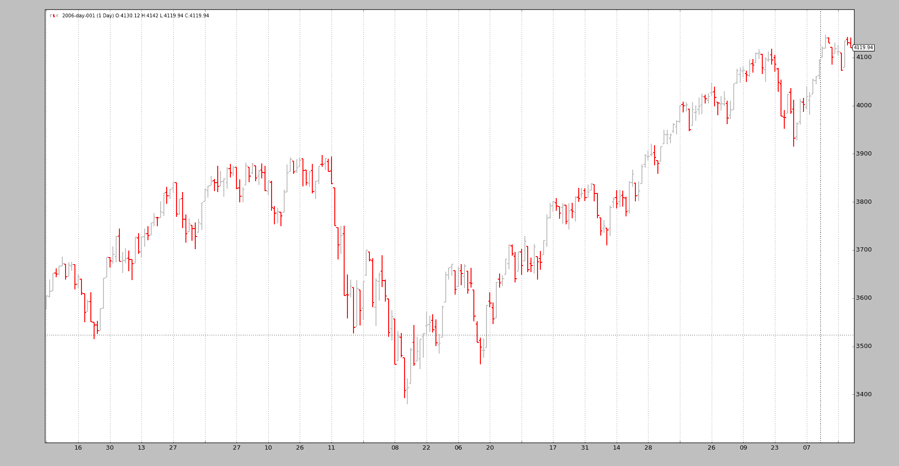
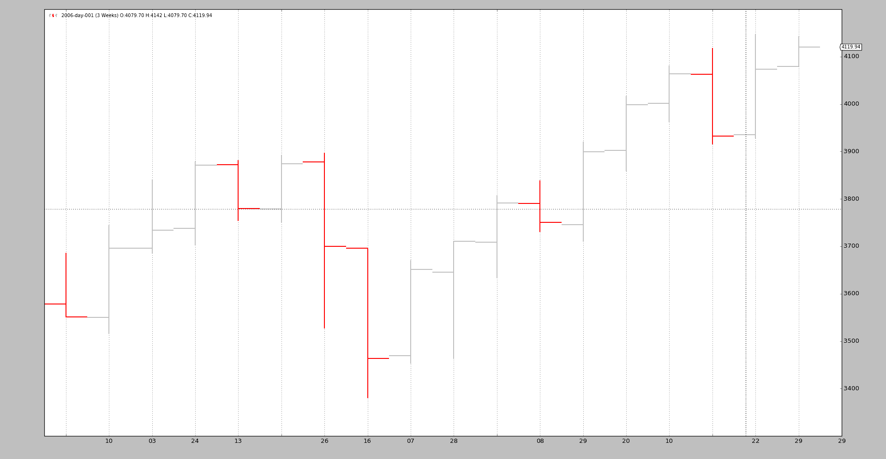

# 数据重采样

> 原文： [https://www.backtrader.com/docu/data-resampling/data-resampling/](https://www.backtrader.com/docu/data-resampling/data-resampling/)

当数据仅在一个时间段内可用，并且必须针对不同的时间段进行分析时，是时候进行一些重采样了。

“重采样”实际上应该被称为“上采样”，因为从源时间段到更大的时间段（例如：几天到几周）

`backtrader`内置了通过过滤对象传递原始数据进行重采样的支持。尽管有几种方法可以实现这一点，但有一个简单的接口可以实现这一点：

*   而不是使用`cerebro.adddata(data)`将`data`放入系统使用中

    `cerebro.resampledata(data, **kwargs)`

有两个主要选项可以控制

*   改变时间表

*   压杆

为此，请在调用`resampledata`时使用以下参数：

*   `timeframe`（默认值：bt.TimeFrame.Days）

    有用的目标时间范围必须等于或大于源时间范围

*   `compression`（默认值：1）

    将所选值“n”压缩到 1 巴

让我们看一个从每天到每周的手工脚本示例：

```py
$ ./resampling-example.py --timeframe weekly --compression 1 
```

输出：

[](../resample-daily-weekly.png)

我们可以将其与原始每日数据进行比较：

```py
$ ./resampling-example.py --timeframe daily --compression 1 
```

输出：

[](../resample-daily-daily.png)

通过执行以下步骤，可以完成此魔术：

*   像往常一样加载数据

*   使用`resampledata`和所需参数将数据输入大脑：

    *   `timeframe`

    *   `compression`

示例中的代码（底部的整个脚本）。

```py
 # Load the Data
    datapath = args.dataname or '../../datas/2006-day-001.txt'
    data = btfeeds.BacktraderCSVData(dataname=datapath)

    # Handy dictionary for the argument timeframe conversion
    tframes = dict(
        daily=bt.TimeFrame.Days,
        weekly=bt.TimeFrame.Weeks,
        monthly=bt.TimeFrame.Months)

    # Add the resample data instead of the original
    cerebro.resampledata(data,
                         timeframe=tframes[args.timeframe],
                         compression=args.compression) 
```

最后一个示例中，我们首先将时间范围从每天更改为每周，然后应用 3:1 压缩：

```py
$ ./resampling-example.py --timeframe weekly --compression 3 
```

输出：

[](../resample-daily-weekly-3.png)

从原来的 256 个每日酒吧，我们最终有 18 个 3 周酒吧。分项数字：

*   52 周

*   52/3=17.33，因此为 18 巴

不用花太多时间。当然，日内数据也可以重新采样。

重采样过滤器支持附加参数，在大多数情况下不应触及这些参数：

*   `bar2edge`（默认为`True`）

    使用时间边界作为目标重新采样。例如，使用“滴答声->5 秒”，生成的 5 秒条形图将与 xx:00、xx:05、xx:10 对齐…

*   `adjbartime`（默认为`True`）

    使用边界处的时间调整交付的重采样条的时间，而不是上次看到的时间戳。如果重新采样为“5 秒”，则即使最后看到的时间戳为 hh:mm:04.33，条形图的时间也将调整为 hh:mm:05

    笔记

    只有当“bar2edge”为真时，才会调整时间。如果该条未与边界对齐，则调整时间是没有意义的

*   `rightedge`（默认为`True`）

    使用时间边界的右边缘设置时间。

    如果为 False 并压缩到 5 秒，则 hh:mm:00 和 hh:mm:04 之间的重新采样条的秒时间将为 hh:mm:00（起始边界）

    如果为 True，则该时间使用的边界将为 hh:mm:05（结束边界）

*   `boundoff`（默认为`0`）

    按一定数量的单位推送重新采样/重放的边界。

    例如，如果重采样是从*1 分钟*到*15 分钟*，默认行为是从*00:01:00*到*00:15:00*取 1 分钟的条形图，以生成 15 分钟的重放/重采样条形图。

    如果`boundoff`设置为`1`，则边界向前推`1 unit`。在这种情况下，原始的*单元*为*1 分钟*巴。因此，重采样/重放现在将：

    *   使用*00:00:00*到*00:14:00*之间的条形图生成 15 分钟条形图

重采样测试脚本的示例代码。

```py
from __future__ import (absolute_import, division, print_function,
                        unicode_literals)

import argparse

import backtrader as bt
import backtrader.feeds as btfeeds

def runstrat():
    args = parse_args()

    # Create a cerebro entity
    cerebro = bt.Cerebro(stdstats=False)

    # Add a strategy
    cerebro.addstrategy(bt.Strategy)

    # Load the Data
    datapath = args.dataname or '../../datas/2006-day-001.txt'
    data = btfeeds.BacktraderCSVData(dataname=datapath)

    # Handy dictionary for the argument timeframe conversion
    tframes = dict(
        daily=bt.TimeFrame.Days,
        weekly=bt.TimeFrame.Weeks,
        monthly=bt.TimeFrame.Months)

    # Add the resample data instead of the original
    cerebro.resampledata(data,
                         timeframe=tframes[args.timeframe],
                         compression=args.compression)

    # Run over everything
    cerebro.run()

    # Plot the result
    cerebro.plot(style='bar')

def parse_args():
    parser = argparse.ArgumentParser(
        description='Pandas test script')

    parser.add_argument('--dataname', default='', required=False,
                        help='File Data to Load')

    parser.add_argument('--timeframe', default='weekly', required=False,
                        choices=['daily', 'weekly', 'monhtly'],
                        help='Timeframe to resample to')

    parser.add_argument('--compression', default=1, required=False, type=int,
                        help='Compress n bars into 1')

    return parser.parse_args()

if __name__ == '__main__':
    runstrat() 
```