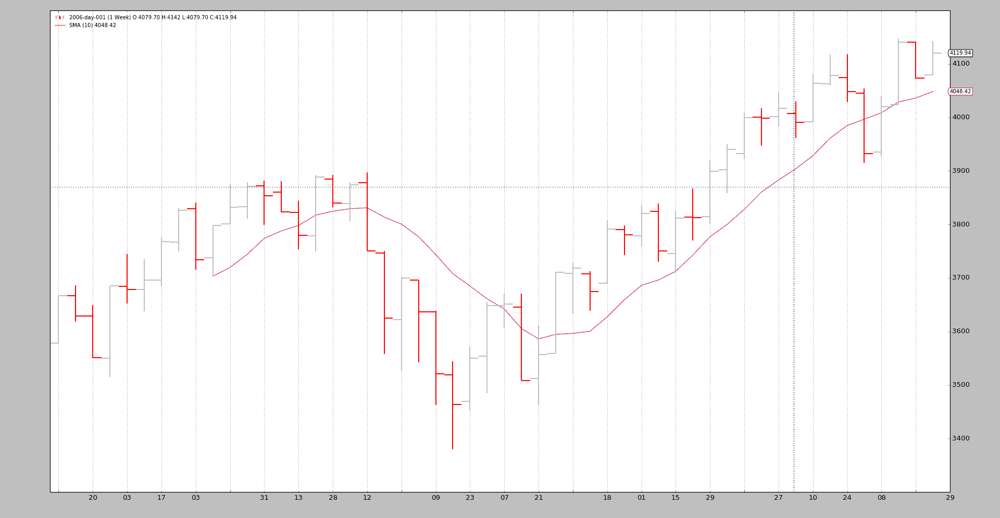
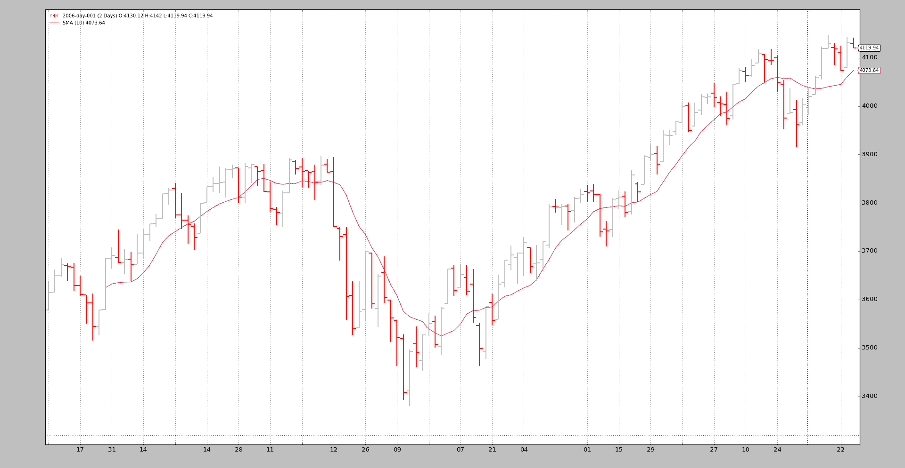

# 数据重播

> 原文： [https://www.backtrader.com/docu/data-replay/data-replay/](https://www.backtrader.com/docu/data-replay/data-replay/)

时间一去不复返了，在一个完全成型的封闭酒吧中测试一个策略是好的，但它可能会更好。

这就是*数据重播*提供帮助的地方。如果：

*   该策略对时间范围为 X 的数据进行操作（例如：每日）

和

*   可获得较小时间段 Y（例如：1 分钟）的数据

数据重播的作用与名称的含义完全相同：

*   使用 1 分钟的数据重播每日条形图

当然，这并不完全是市场发展的方式，但它远比孤立地看待每日完全成形和封闭的酒吧要好得多：

如果策略在每日酒吧的形成过程中实时运行，酒吧形成的近似值提供了在真实条件下复制策略实际行为的机会

将*数据回放*付诸实施遵循`backtrader`的常规使用模式

*   加载数据源

*   通过`replaydata`将数据传递给大脑

*   添加策略

笔记

重放数据时不支持预加载，因为每个条实际上都是实时构建的。在任何`Cerebro`实例中自动禁用。

可传递给`replaydata`的参数：

*   `timeframe`（默认值：bt.TimeFrame.Days）

    有用的目标时间范围必须等于或大于源时间范围

*   `compression`（默认值：1）

    将所选值“n”压缩到 1 巴

扩展参数（如果不是真的需要，请勿触摸）：

*   `bar2edge`（默认为 True）

    使用时间边界作为闭合条的目标进行回放。例如，使用“滴答声->5 秒”，生成的 5 秒条形图将与 xx:00、xx:05、xx:10 对齐…

*   `adjbartime`（默认为 False）

    使用边界处的时间调整交付的重采样条的时间，而不是上次看到的时间戳。如果重新采样为“5 秒”，则即使最后看到的时间戳为 hh:mm:04.33，条形图的时间也将调整为 hh:mm:05

    **注**：只有当“bar2edge”为真时，才会调整时间。如果该条未与边界对齐，则调整时间是没有意义的

*   `rightedge`（默认为 True）

    使用时间边界的右边缘设置时间。

    如果为 False 并压缩到 5 秒，则 hh:mm:00 和 hh:mm:04 之间的重新采样条的秒时间将为 hh:mm:00（起始边界）

    如果为 True，则该时间使用的边界将为 hh:mm:05（结束边界）

为了使用示例，将每周重播标准的 2006 年每日数据。这意味着：

*   最终将有 52 家酒吧，每周一家

*   大脑将调用`prenext`和`next`总共 255 次，这是每日酒吧的原始计数

诀窍：

*   当形成一个周线时，策略的长度（`len(self)`将保持不变。

*   每过一周，长度将增加一个

下面是一些示例，但首先是测试脚本的示例，在该脚本中，数据被加载并通过`replaydata`传递到 Cerbero……然后是`run`。

```py
 # Load the Data
    datapath = args.dataname or '../../datas/2006-day-001.txt'
    data = btfeeds.BacktraderCSVData(dataname=datapath)

    # Handy dictionary for the argument timeframe conversion
    tframes = dict(
        daily=bt.TimeFrame.Days,
        weekly=bt.TimeFrame.Weeks,
        monthly=bt.TimeFrame.Months)

    # First add the original data - smaller timeframe
    cerebro.replaydata(data,
                       timeframe=tframes[args.timeframe],
                       compression=args.compression) 
```

## 示例-从每天重播到每周重播

脚本的调用：

```py
$ ./replay-example.py --timeframe weekly --compression 1 
```

不幸的是，该图表无法向我们显示背景中发生的真实情况，因此让我们看看控制台输出：

```py
prenext len 1 - counter 1
prenext len 1 - counter 2
prenext len 1 - counter 3
prenext len 1 - counter 4
prenext len 1 - counter 5
prenext len 2 - counter 6
...
...
prenext len 9 - counter 44
prenext len 9 - counter 45
---next len 10 - counter 46
---next len 10 - counter 47
---next len 10 - counter 48
---next len 10 - counter 49
---next len 10 - counter 50
---next len 11 - counter 51
---next len 11 - counter 52
---next len 11 - counter 53
...
...
---next len 51 - counter 248
---next len 51 - counter 249
---next len 51 - counter 250
---next len 51 - counter 251
---next len 51 - counter 252
---next len 52 - counter 253
---next len 52 - counter 254
---next len 52 - counter 255 
```

正如我们看到的，内部的`self.counter`变量正在跟踪对`prenext`或`next`的每次调用。在应用简单移动平均线生成值之前调用前者。当简单移动平均值产生值时，调用后者。

关键是：

*   策略的长度（len（self））每 5 条（一周中的 5 个交易日）改变一次

该战略有效地看到：

*   每周酒吧如何在 5 次拍摄中发展。

    同样，这并没有复制市场的实际逐点（甚至不是每分钟、每小时）发展，但它比实际看到一个酒吧要好。

视觉输出是周线图的输出，周线图是系统再次测试的最终结果。

[](../replay-daily-weekly.png)

## 示例 2-每日到每日压缩

当然，“重放”可以应用于相同的时间段，但需要压缩。

控制台：

```py
$ ./replay-example.py --timeframe daily --compression 2
prenext len 1 - counter 1
prenext len 1 - counter 2
prenext len 2 - counter 3
prenext len 2 - counter 4
prenext len 3 - counter 5
prenext len 3 - counter 6
prenext len 4 - counter 7
...
...
---next len 125 - counter 250
---next len 126 - counter 251
---next len 126 - counter 252
---next len 127 - counter 253
---next len 127 - counter 254
---next len 128 - counter 255 
```

这一次，由于因子 2 要求的压缩，我们得到了预期的一半钢筋。

图表：

[](../replay-daily-daily-compression-2.png)

## 结论

重建市场发展是可能的。通常有一组较小的时间段数据可用，可用于离散地重播系统运行的时间段。

测试脚本。

```py
from __future__ import (absolute_import, division, print_function,
                        unicode_literals)

import argparse

import backtrader as bt
import backtrader.feeds as btfeeds
import backtrader.indicators as btind

class SMAStrategy(bt.Strategy):
    params = (
        ('period', 10),
        ('onlydaily', False),
    )

    def __init__(self):
        self.sma = btind.SMA(self.data, period=self.p.period)

    def start(self):
        self.counter = 0

    def prenext(self):
        self.counter += 1
        print('prenext len %d - counter %d' % (len(self), self.counter))

    def next(self):
        self.counter += 1
        print('---next len %d - counter %d' % (len(self), self.counter))

def runstrat():
    args = parse_args()

    # Create a cerebro entity
    cerebro = bt.Cerebro(stdstats=False)

    cerebro.addstrategy(
        SMAStrategy,
        # args for the strategy
        period=args.period,
    )

    # Load the Data
    datapath = args.dataname or '../../datas/2006-day-001.txt'
    data = btfeeds.BacktraderCSVData(dataname=datapath)

    # Handy dictionary for the argument timeframe conversion
    tframes = dict(
        daily=bt.TimeFrame.Days,
        weekly=bt.TimeFrame.Weeks,
        monthly=bt.TimeFrame.Months)

    # First add the original data - smaller timeframe
    cerebro.replaydata(data,
                       timeframe=tframes[args.timeframe],
                       compression=args.compression)

    # Run over everything
    cerebro.run()

    # Plot the result
    cerebro.plot(style='bar')

def parse_args():
    parser = argparse.ArgumentParser(
        description='Pandas test script')

    parser.add_argument('--dataname', default='', required=False,
                        help='File Data to Load')

    parser.add_argument('--timeframe', default='weekly', required=False,
                        choices=['daily', 'weekly', 'monhtly'],
                        help='Timeframe to resample to')

    parser.add_argument('--compression', default=1, required=False, type=int,
                        help='Compress n bars into 1')

    parser.add_argument('--period', default=10, required=False, type=int,
                        help='Period to apply to indicator')

    return parser.parse_args()

if __name__ == '__main__':
    runstrat() 
```