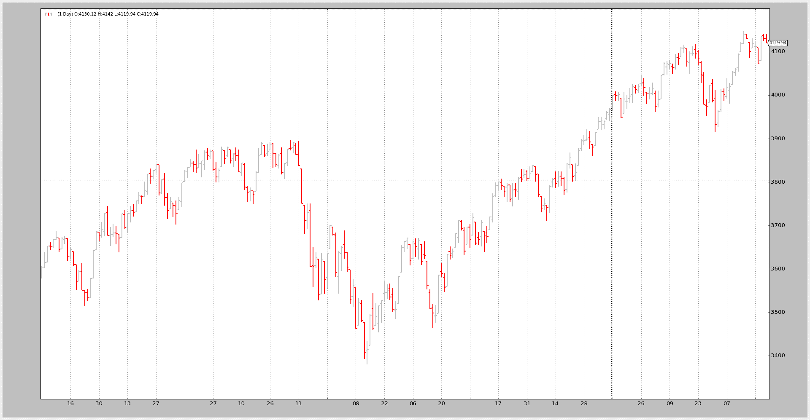

# 熊猫数据源示例

> 原文： [https://www.backtrader.com/docu/pandas-datafeed/pandas-datafeed/](https://www.backtrader.com/docu/pandas-datafeed/pandas-datafeed/)

笔记

必须安装`pandas`及其依赖项

支持[熊猫](http://pandas.pydata.org)数据帧似乎是很多人关心的问题，他们依赖于熊猫提供的不同数据源（包括 CSV）和其他功能的现有解析代码。

Datafeed 的重要声明。

笔记

这些仅为**声明。不要盲目复制此代码。请参见下面示例中的实际用法**

```py
class PandasData(feed.DataBase):
    '''
 The ``dataname`` parameter inherited from ``feed.DataBase`` is the pandas
 DataFrame
 '''

    params = (
        # Possible values for datetime (must always be present)
        #  None : datetime is the "index" in the Pandas Dataframe
        #  -1 : autodetect position or case-wise equal name
        #  >= 0 : numeric index to the colum in the pandas dataframe
        #  string : column name (as index) in the pandas dataframe
        ('datetime', None),

        # Possible values below:
        #  None : column not present
        #  -1 : autodetect position or case-wise equal name
        #  >= 0 : numeric index to the colum in the pandas dataframe
        #  string : column name (as index) in the pandas dataframe
        ('open', -1),
        ('high', -1),
        ('low', -1),
        ('close', -1),
        ('volume', -1),
        ('openinterest', -1),
    ) 
```

以上摘自`PandasData`类的内容显示了关键点：

*   实例化期间类的`dataname`参数保存数据帧

    此参数继承自基类`feed.DataBase`

*   新参数具有`DataSeries`中规则字段的名称，并遵循这些约定

    *   `datetime`（默认为无）

    *   无：datetime 是数据帧中的“索引”

    *   -1：自动检测位置或按大小写的相等名称

    *   > =0：数据帧中列的数字索引

    *   字符串：数据框中的列名（作为索引）

    *   `open`、`high`、`low`、`high`、`close`、`volume`、`openinterest`（默认值：所有为 1）

    *   无：列不存在

    *   -1：自动检测位置或按大小写的相等名称

    *   > =0：数据帧中列的数字索引

    *   字符串：数据框中的列名（作为索引）

一个小样本应该能够加载 standar 2006 样本，该样本已经由`Pandas`解析，而不是直接由`backtrader`解析

运行示例以使用 CSV 数据中的现有“标题”：

```py
$ ./panda-test.py
--------------------------------------------------
               Open     High      Low    Close  Volume  OpenInterest
Date
2006-01-02  3578.73  3605.95  3578.73  3604.33       0             0
2006-01-03  3604.08  3638.42  3601.84  3614.34       0             0
2006-01-04  3615.23  3652.46  3615.23  3652.46       0             0 
```

相同，但告诉脚本跳过标题：

```py
$ ./panda-test.py --noheaders
--------------------------------------------------
                  1        2        3        4  5  6
0
2006-01-02  3578.73  3605.95  3578.73  3604.33  0  0
2006-01-03  3604.08  3638.42  3601.84  3614.34  0  0
2006-01-04  3615.23  3652.46  3615.23  3652.46  0  0 
```

第 2 次<sup>和第</sup>运行正在使用告知`pandas.read_csv`：

*   跳过第一个输入行（`skiprows`关键字参数设置为 1）

*   不查找标题行（`header`关键字参数设置为无）

对 Pandas 的`backtrader`支持试图自动检测是否使用了列名或数字索引，并相应地采取行动，试图提供最佳匹配。

下表是对成功的致敬。熊猫数据帧已正确加载（在这两种情况下）

[](../pandas-headers.png)

测试的示例代码。

```py
from __future__ import (absolute_import, division, print_function,
                        unicode_literals)

import argparse

import backtrader as bt
import backtrader.feeds as btfeeds

import pandas

def runstrat():
    args = parse_args()

    # Create a cerebro entity
    cerebro = bt.Cerebro(stdstats=False)

    # Add a strategy
    cerebro.addstrategy(bt.Strategy)

    # Get a pandas dataframe
    datapath = ('../../datas/2006-day-001.txt')

    # Simulate the header row isn't there if noheaders requested
    skiprows = 1 if args.noheaders else 0
    header = None if args.noheaders else 0

    dataframe = pandas.read_csv(datapath,
                                skiprows=skiprows,
                                header=header,
                                parse_dates=True,
                                index_col=0)

    if not args.noprint:
        print('--------------------------------------------------')
        print(dataframe)
        print('--------------------------------------------------')

    # Pass it to the backtrader datafeed and add it to the cerebro
    data = bt.feeds.PandasData(dataname=dataframe)

    cerebro.adddata(data)

    # Run over everything
    cerebro.run()

    # Plot the result
    cerebro.plot(style='bar')

def parse_args():
    parser = argparse.ArgumentParser(
        description='Pandas test script')

    parser.add_argument('--noheaders', action='store_true', default=False,
                        required=False,
                        help='Do not use header rows')

    parser.add_argument('--noprint', action='store_true', default=False,
                        help='Print the dataframe')

    return parser.parse_args()

if __name__ == '__main__':
    runstrat() 
```