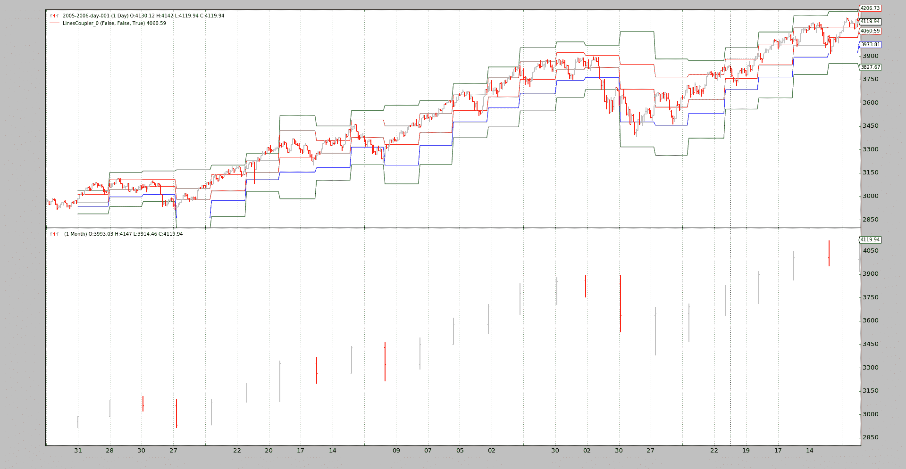

# 在指标中混合时间框架

> 原文： [https://www.backtrader.com/docu/mixing-timeframes/indicators-mixing-timeframes/](https://www.backtrader.com/docu/mixing-timeframes/indicators-mixing-timeframes/)

[版本 1.3.0.92](https://github.com/mementum/backtrader/releases/tag/1.3.0.92)提出了将来自不同时间段的数据（来自数据源和/或指示器）混合的可能性。

背景：*指示器是智能哑对象。*

*   他们很聪明，因为他们可以进行复杂的计算。

*   他们之所以愚蠢，是因为他们不知道是什么来源为计算提供了数据

像这样的：

*   如果提供数值的数据源在`Cerebro`引擎内具有不同的时间段、不同的长度，则指示器将断开。

计算示例，其中`data0`的时间段为天，`data1`的时间段为`months`：

```py
pivotpoint = btind.PivotPoint(self.data1)
sellsignal = self.data0.close < pivotpoint.s1 
```

在这里，当收盘价低于`s1`线（*1<sup>st</sup>支撑*时，寻求*卖出信号*

笔记

根据定义，`PivotPoint`在更大的时间范围内工作

这将在过去导致以下错误：

```py
return self.array[self.idx + ago]
IndexError: array index out of range 
```

还有一个很好的理由：`self.data.close`提供了从<sup>st</sup>瞬间开始的值，但`PivotPoint`（以及`s1`行）只会在**整月**过去后提供一次值，大约相当于`self.data0.close`的 22 个值。在此 22*关闭*期间，`s1`还没有一个值，尝试从基础阵列获取它失败。

*行*对象支持`(ago)`操作符（*Python*中的`__call__`特殊方法）来传递自身的延迟版本：

```py
close1 = self.data.close(-1) 
```

在本例中，对象`close1`（通过`[0]`访问时）始终包含`close`传递的先前值（`-1`。该语法已被重用，以适应适应时间范围。让我们重写上面的`pivotpoint`片段：

```py
pivotpoint = btind.PivotPoint(self.data1)
sellsignal = self.data0.close < pivotpoint.s1() 
```

查看如何在没有参数的情况下执行`()`（在后台提供了一个`None`）。发生了以下情况：

*   `pivotpoint.s1()`返回一个内部`LinesCoupler`对象，该对象遵循较大范围的节奏。此耦合器使用实际`s1`的最新传递值填充自身（从默认值`NaN`开始）

但是需要一些额外的东西才能让魔法发挥作用。`Cerebro`必须通过以下方式创建：

```py
cerebro = bt.Cerebro(runonce=False) 
```

或通过以下方式执行：

```py
cerebro.run(runonce=False) 
```

在该模式下，指示器和后期评估的自动*行*对象是逐步执行的，而不是紧密循环。这使整个操作变慢，但它使**成为可能**

底部的示例脚本在上面中断，现在运行：

```py
$ ./mixing-timeframes.py 
```

输出：

```py
0021,0021,0001,2005-01-31,2984.75,2935.96,0.00
0022,0022,0001,2005-02-01,3008.85,2935.96,0.00
...
0073,0073,0003,2005-04-15,3013.89,3010.76,0.00
0074,0074,0003,2005-04-18,2947.79,3010.76,1.00
... 
```

在第 74 行，`close < s1`的 1<sup>st</sup>实例发生。

该脚本还提供了对附加可能性的深入了解：*耦合指示器*的所有行。在我们之前：

```py
self.sellsignal = self.data0.close < pp.s1() 
```

作为替代方案：

```py
pp1 = pp()
self.sellsignal = self.data0.close < pp1.s1 
```

现在整个`PivotPoint`指示器已经耦合，可以访问其任何线路（即`p`、`r1`、`r2`、`s1`、`s2`）。脚本只对`s1`感兴趣，访问是直接的：

```py
$ ./mixing-timeframes.py --multi 
```

输出：

```py
0021,0021,0001,2005-01-31,2984.75,2935.96,0.00
0022,0022,0001,2005-02-01,3008.85,2935.96,0.00
...
0073,0073,0003,2005-04-15,3013.89,3010.76,0.00
0074,0074,0003,2005-04-18,2947.79,3010.76,1.00
... 
```

这一点也不奇怪。和以前一样。甚至可以绘制“耦合”对象：

```py
$ ./mixing-timeframes.py --multi --plot 
```

[](../indicators-mixing-timeframes.png)

## 全耦合语法

对于具有多行的*行*对象（例如*指示器*如`PivotPoint`：

*   `obj(clockref=None, line=-1)`

    *   `clockref`如果`clockref`是`None`，则周围对象（在示例 a`Strategy`中）将作为参考，以适应较大的时间段（例如：`Months`）以适应较小/较快的时间段（例如：`Days`）

    如果需要，可以使用另一个参考

    `line`

    ```py
    * If the default `-1` is given, all *lines* are coupled.

    * If another integer (for example, `0` or `1`) a single line will be
      coupled and fetched by index (from `obj.lines[x]`)

    * If a string is passed, the line will be fetched by name.

      In the sample, the following could have been done:

      ```python
      coupled_s1 = pp(line='s1')
      ```py 
    ```

对于具有单行的*行*对象（例如来自指示器`PivotPoint`的`s1`行）：

*   `obj(clockref=None)`（见上文`clockref`）

## 结论

在常规的`()`语法中，来自不同时间段的数据馈送可以混合在指标中，始终考虑到`cerebro`需要实例化或使用`runonce=False`创建。

## 脚本代码和用法

在`backtrader`的来源中作为样品提供。用法：

```py
$ ./mixing-timeframes.py --help
usage: mixing-timeframes.py [-h] [--data DATA] [--multi] [--plot]

Sample for pivot point and cross plotting

optional arguments:
  -h, --help   show this help message and exit
  --data DATA  Data to be read in (default: ../../datas/2005-2006-day-001.txt)
  --multi      Couple all lines of the indicator (default: False)
  --plot       Plot the result (default: False) 
```

守则：

```py
from __future__ import (absolute_import, division, print_function,
                        unicode_literals)

import argparse

import backtrader as bt
import backtrader.feeds as btfeeds
import backtrader.indicators as btind
import backtrader.utils.flushfile

class St(bt.Strategy):
    params = dict(multi=True)

    def __init__(self):
        self.pp = pp = btind.PivotPoint(self.data1)
        pp.plotinfo.plot = False  # deactivate plotting

        if self.p.multi:
            pp1 = pp()  # couple the entire indicators
            self.sellsignal = self.data0.close < pp1.s1
        else:
            self.sellsignal = self.data0.close < pp.s1()

    def next(self):
        txt = ','.join(
            ['%04d' % len(self),
             '%04d' % len(self.data0),
             '%04d' % len(self.data1),
             self.data.datetime.date(0).isoformat(),
             '%.2f' % self.data0.close[0],
             '%.2f' % self.pp.s1[0],
             '%.2f' % self.sellsignal[0]])

        print(txt)

def runstrat():
    args = parse_args()

    cerebro = bt.Cerebro()
    data = btfeeds.BacktraderCSVData(dataname=args.data)
    cerebro.adddata(data)
    cerebro.resampledata(data, timeframe=bt.TimeFrame.Months)

    cerebro.addstrategy(St, multi=args.multi)

    cerebro.run(stdstats=False, runonce=False)
    if args.plot:
        cerebro.plot(style='bar')

def parse_args():
    parser = argparse.ArgumentParser(
        formatter_class=argparse.ArgumentDefaultsHelpFormatter,
        description='Sample for pivot point and cross plotting')

    parser.add_argument('--data', required=False,
                        default='../../datas/2005-2006-day-001.txt',
                        help='Data to be read in')

    parser.add_argument('--multi', required=False, action='store_true',
                        help='Couple all lines of the indicator')

    parser.add_argument('--plot', required=False, action='store_true',
                        help=('Plot the result'))

    return parser.parse_args()

if __name__ == '__main__':
    runstrat() 
```