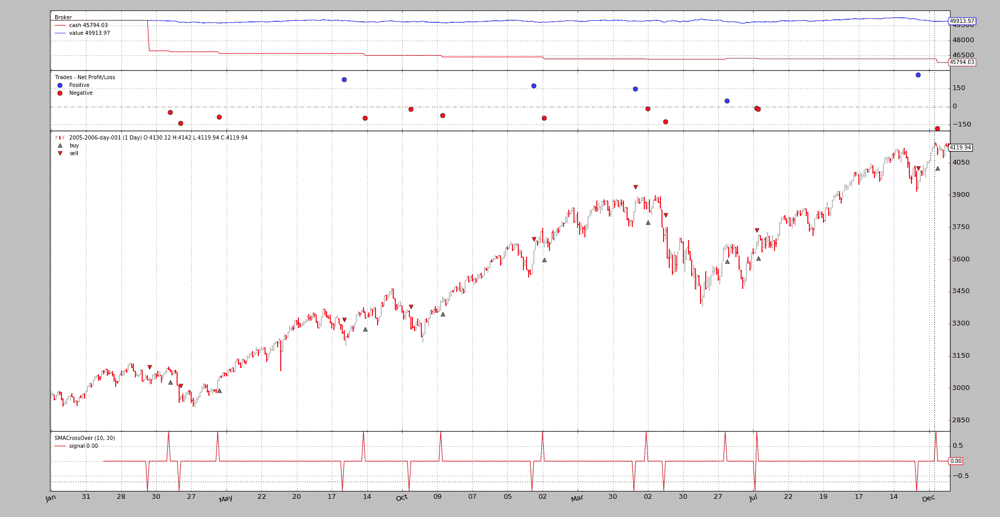

# 下降

> 原文： [https://www.backtrader.com/docu/slippage/slippage/](https://www.backtrader.com/docu/slippage/slippage/)

回溯测试不能保证真实的市场条件。无论市场模拟有多好，在真实的市场条件下，都可能发生滑动。这意味着：

*   请求的价格可能不匹配。

集成的回溯测试代理支持滑动。可以将以下参数传递给代理

*   `slip_perc`（默认值：`0.0`）绝对术语的百分比（和正值），应用于推高/下调买入/卖出订单的价格

    注:

    *   `0.01`是`1%`

    *   `0.001`是`0.1%`

*   `slip_fixed`（默认值：`0.0`）单位百分比（和正值），用于买卖订单上/下滑动价格

    注：若`slip_perc`为非零，则其先于此。

*   `slip_open`（默认值：`False`）订单执行是否打滑，具体使用下一条*期初*价格。一个例子是`Market`订单，该订单使用下一个可用的勾号执行，即：酒吧的开盘价。

    这也适用于其他一些执行，因为当移动到新条时，逻辑试图检测*期初*价格是否与请求的价格/执行类型匹配。

*   `slip_match`（默认为`True`）

    如果`True`经纪人将提供匹配，以`high/low`价格封顶滑动，以防超过。

    如果`False`经纪人不会将订单与当前价格匹配，并将在下一次迭代中尝试执行

*   `slip_limit`（默认为`True`）

    `Limit`即使`slip_match`为`False`也会根据要求的准确匹配价格匹配订单。

    此选项控制该行为。

    如果为`True`，则`Limit`订单将通过封顶价格与`limit`/`high/low`价格匹配

    如果`False`和滑动超过上限，则将不存在匹配

*   `slip_out`（默认为`False`）

    即使价格在`high`-`low`范围之外，也要提供*打滑*。

## 工作原理

为了决定何时应用*打滑*需要考虑订单执行类型：

*   `Close`-**无滑移**应用

    此订单与`close`价格匹配，此价格为当天最后一个价格。打滑不可能发生，因为订单只能在交易的最后一个滴答声发生，而且这是一个唯一的价格，没有任何容差。

*   采用`Market`-*滑移*

    请检查`slip_open`异常。因为`Market`订单将与下一个酒吧的*开盘*价格匹配。

*   `Limit`-*滑移*按此逻辑应用

    *   如果匹配价格为*期初*价格，则根据参数`slip_open`应用*滑移*。如果适用，价格将永远不会低于要求的`limit`价格

    *   如果匹配价格不是`limit`价格，则在`high/low`处应用*滑移*封顶。在这种情况下，`slip_mlimit`适用于决定如果超过上限，是否会发生匹配

    *   如果匹配价格为`limit`价格，则不应用打滑

*   `Stop`-一旦*触发*订单，则应用与`Market`订单相同的逻辑

*   `StopLimit`-一旦*触发*订单，则应用与`Limit`订单相同的逻辑

这种方法试图在模拟和可用数据的范围内提供最现实的可能方法

## 配置滑动

*代理*已经由*大脑*引擎为每次运行使用默认参数实例化。有两种方法可以改变行为：

*   使用方法配置*滑动*

    #### BackBroker.set_sliptage_perc（perc，slip_open=True，slip_limit=True，slip_match=True，slip_out=False）

    将滑动配置为基于百分比

    #### BackBroker.set_slipation_fixed（固定，滑动打开=真，滑动限制=真，滑动匹配=真，滑动退出=假）

    将滑动配置为基于固定点

*   替换代理，如中所示：

    ```py
    import backtrader as bt

    cerebro = bt.Cerebro()
    cerebro.broker = bt.brokers.BackBroker(slip_perc=0.005)  # 0.5% 
    ```

## 实例

源包含使用订单执行类型`Market`的样本和使用*信号*的*长/短*方法。这应该允许我们理解逻辑。

无滑移运行和初始图，以供以后参考：

```py
$ ./slippage.py --plot
01 2005-03-22 23:59:59 SELL Size: -1 / Price: 3040.55
02 2005-04-11 23:59:59 BUY  Size: +1 / Price: 3088.47
03 2005-04-11 23:59:59 BUY  Size: +1 / Price: 3088.47
04 2005-04-19 23:59:59 SELL Size: -1 / Price: 2948.38
05 2005-04-19 23:59:59 SELL Size: -1 / Price: 2948.38
06 2005-05-19 23:59:59 BUY  Size: +1 / Price: 3034.88
...
35 2006-12-19 23:59:59 BUY  Size: +1 / Price: 4121.01 
```

[](../no-slippage.png)

使用*滑动*进行相同的运行，配置`1.5%`：

```py
$ ./slippage.py --slip_perc 0.015
01 2005-03-22 23:59:59 SELL Size: -1 / Price: 3040.55
02 2005-04-11 23:59:59 BUY  Size: +1 / Price: 3088.47
03 2005-04-11 23:59:59 BUY  Size: +1 / Price: 3088.47
04 2005-04-19 23:59:59 SELL Size: -1 / Price: 2948.38
05 2005-04-19 23:59:59 SELL Size: -1 / Price: 2948.38
06 2005-05-19 23:59:59 BUY  Size: +1 / Price: 3034.88
...
35 2006-12-19 23:59:59 BUY  Size: +1 / Price: 4121.01 
```

**无变化**。这是该场景的预期行为。

*   执行类型：`Market`

*   且`slip_open`未设置为`True`

    `Market`订单与下一个酒吧的*开盘*价格匹配，我们不允许`open`价格变动。

将运行设置`slip_open`设置为`True`：

```py
$ ./slippage.py --slip_perc 0.015 --slip_open
01 2005-03-22 23:59:59 SELL Size: -1 / Price: 3021.66
02 2005-04-11 23:59:59 BUY  Size: +1 / Price: 3088.47
03 2005-04-11 23:59:59 BUY  Size: +1 / Price: 3088.47
04 2005-04-19 23:59:59 SELL Size: -1 / Price: 2948.38
05 2005-04-19 23:59:59 SELL Size: -1 / Price: 2948.38
06 2005-05-19 23:59:59 BUY  Size: +1 / Price: 3055.14
...
35 2006-12-19 23:59:59 BUY  Size: +1 / Price: 4121.01 
```

人们可以立即看到价格**已经变动**。分配的价格是最差的或与操作 35 相同。*这不是复制粘贴错误*

*   2016-12-19 的`open`和`high`是相同的。

    价格不能推到`high`以上，因为这意味着返回一个不存在的价格。

当然，*反向交易者*允许在`high`-`low`范围外匹配`slip_out`。已激活的跑步：

```py
$ ./slippage.py --slip_perc 0.015 --slip_open --slip_out
01 2005-03-22 23:59:59 SELL Size: -1 / Price: 2994.94
02 2005-04-11 23:59:59 BUY  Size: +1 / Price: 3134.80
03 2005-04-11 23:59:59 BUY  Size: +1 / Price: 3134.80
04 2005-04-19 23:59:59 SELL Size: -1 / Price: 2904.15
05 2005-04-19 23:59:59 SELL Size: -1 / Price: 2904.15
06 2005-05-19 23:59:59 BUY  Size: +1 / Price: 3080.40
...
35 2006-12-19 23:59:59 BUY  Size: +1 / Price: 4182.83 
```

匹配价格的匹配表达式是：OMG！（天哪！）。价格显然超出了范围。只需查看操作 35 即可，该操作已在`4182.83`处匹配。快速查看本文档中的图表可以发现，该资产从未接近该价格。

`slip_match`有`True`的违约，这意味着*反向交易者*提供了一个匹配，可以是上面看到的有上限或无上限价格。让我们禁用它：

```py
$ ./slippage.py --slip_perc 0.015 --slip_open --no-slip_match
01 2005-04-15 23:59:59 SELL Size: -1 / Price: 3028.10
02 2005-05-18 23:59:59 BUY  Size: +1 / Price: 3029.40
03 2005-06-01 23:59:59 BUY  Size: +1 / Price: 3124.03
04 2005-10-06 23:59:59 SELL Size: -1 / Price: 3365.57
05 2005-10-06 23:59:59 SELL Size: -1 / Price: 3365.57
06 2005-12-01 23:59:59 BUY  Size: +1 / Price: 3499.95
07 2005-12-01 23:59:59 BUY  Size: +1 / Price: 3499.95
08 2006-02-28 23:59:59 SELL Size: -1 / Price: 3782.71
09 2006-02-28 23:59:59 SELL Size: -1 / Price: 3782.71
10 2006-05-23 23:59:59 BUY  Size: +1 / Price: 3594.68
11 2006-05-23 23:59:59 BUY  Size: +1 / Price: 3594.68
12 2006-11-27 23:59:59 SELL Size: -1 / Price: 3984.37
13 2006-11-27 23:59:59 SELL Size: -1 / Price: 3984.37 
```

起泡的藤壶！从 35 岁降到 13 岁。理由是：

如果*滑动*会将匹配价格推高到条的`high`或`low`以下，则停用`slip_match`将不允许匹配操作。似乎随着请求的*滑动*的`1.5%`，大约 22 个操作无法执行。

这些例子应该说明不同的*滑动*选项是如何协同工作的。