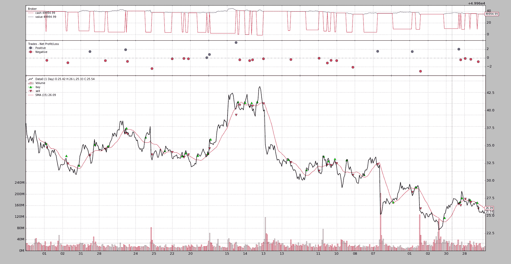
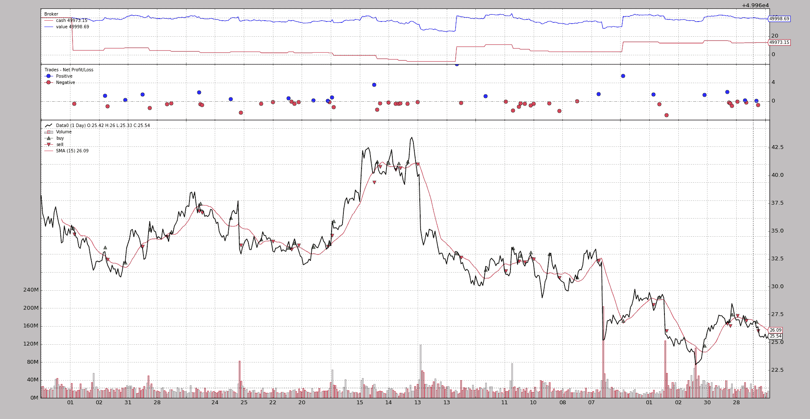

# 浆纱机

> 原文： [https://www.backtrader.com/docu/sizers/sizers/](https://www.backtrader.com/docu/sizers/sizers/)

*   聪明的赌注

*策略*提供了交易方法，即：`buy`、`sell`和`close`。让我们看看`buy`的签名：

```py
def buy(self, data=None,
        size=None, price=None, plimit=None,
        exectype=None, valid=None, tradeid=0, **kwargs): 
```

请注意，如果调用方没有指定，`size`有一个默认值`None`。这就是*浆纱机*发挥重要作用的地方：

*   `size=None`要求*策略*向其*规模商*索要实际股权

这显然意味着*策略*具有*规模*：是的，的确如此！。如果用户还没有添加默认的尺码器，后台机器会将其添加到*策略*中。添加到*策略*中的默认*Sizer*为`SizerFix`。定义的初始行：

```py
class SizerFix(SizerBase):
    params = (('stake', 1),) 
```

很容易猜测，这个*规模的*只是*使用`1`单位`stake`进行*买卖（无论是股票、合同等）

## 使用*施胶器*

### 来自*大脑*

*施胶剂*可通过*大脑*两种不同方式添加：

*   `addsizer(sizercls, *args, **kwargs)`

    添加一个*Sizer*，它将应用于*大脑*中添加的任何策略。也就是说，这是默认的*尺码*。例子：

    ```py
    cerebro = bt.Cerebro()
    cerebro.addsizer(bt.sizers.SizerFix, stake=20)  # default sizer for strategies 
    ```

*   `addsizer_byidx(idx, sizercls, *args, **kwargs)`

    *施胶器*只会添加到`idx`引用的*策略*中

    此`idx`可作为`addstrategy`的返回值获取。例如：

    ```py
    cerebro = bt.Cerebro()
    cerebro.addsizer(bt.sizers.SizerFix, stake=20)  # default sizer for strategies

    idx = cerebro.addstrategy(MyStrategy, myparam=myvalue)
    cerebro.addsizer_byidx(idx, bt.sizers.SizerFix, stake=5)

    cerebro.addstrategy(MyOtherStrategy) 
    ```

    在本例中：

    *   系统中添加了一个默认的*大小器*。这一条适用于所有没有指定具体的*尺寸*的策略

    *   对于*MyStrategy*在收集其插入的*idx*后，添加一个特定的施胶器（更改`stake`参数）

    *   系统中增加了一个 2<sup>nd</sup>策略*MyOtherStrategy*。未添加具体的*施胶剂*

    *   这意味着：

        *   *MyStrategy*最终将拥有一个内部特定的*尺码器*

        *   *MyOtherStrategy*将获得默认大小码

笔记

*默认*并不意味着策略共享一个*Sizer*实例。每个*策略*都会收到一个不同的*默认*sizer 实例

要共享单个实例，要共享的 sizer 应该是 singleton 类。如何定义一个在*反向交易者*范围之外

### 从*策略*

*策略*类提供了一个 API:`setsizer`和`getsizer`（以及一个*属性*`sizer`）来管理*施胶器*。签名：

*   `def setsizer(self, sizer)`：需要一个已经实例化的*Sizer*

*   `def getsizer(self)`：返回当前*Sizer*实例

*   `sizer`可直接*获取/设置*的属性

在这种情况下，*施胶器*可以是：

*   作为参数传递给策略

*   在`__init__`期间使用`sizer`或`setsizer`属性进行设置，如：

    ```py
    class MyStrategy(bt.Strategy):
        params = (('sizer', None),)

        def __init__(self):
            if self.p.sizer is not None:
                self.sizer = self.p.sizer 
    ```

    例如，这将允许在发生*大脑*调用的同一级别创建*大小码*，并将其作为参数传递给系统中的所有策略，这实际上允许共享*大小码*

## *施胶机*开发

这样做很容易：

1.  来自`backtrader.Sizer`的子类

    这使您可以访问`self.strategy`和`self.broker`，尽管在大多数情况下不需要它。可以通过`broker`访问的内容

    *   数据与`self.strategy.getposition(data)`的位置

    *   通过`self.broker.getvalue()`完成投资组合价值

        请注意，这当然也可以通过`self.strategy.broker.getvalue()`完成

    其他一些事情已经作为论据出现在下面

2.  覆盖方法`_getsizing(self, comminfo, cash, data, isbuy)`

    *   `comminfo`：CommissionInfo 实例，包含该数据的佣金信息，允许计算该操作的职位价值、操作成本、佣金

    *   `cash`：在*经纪人*中的当前可用现金

    *   `data`：作业目标

    *   `isbuy`：将`True`用于*买入*操作，将`False`用于*卖出*操作

    此方法返回*买入/卖出*操作所需的`size`

    返回的符号不相关，即：如果操作是*卖出*操作（`isbuy`将是`False`），该方法可能返回`5`或`-5`。*卖出*操作将仅使用绝对值。

    `Sizer`已经进入`broker`并请求*佣金信息*以获取给定*数据*的实际*现金*水平，并直接参考操作目标*数据*

让我们来了解一下`FixedSize`尺寸的定义：

```py
import backtrader as bt

class FixedSize(bt.Sizer):
    params = (('stake', 1),)

    def _getsizing(self, comminfo, cash, data, isbuy):
        return self.params.stake 
```

这非常简单，因为*施胶器*不进行任何计算，参数就在那里。

但该机制应允许构建复杂的*规模*（又称*定位*）系统，以在进入/退出市场时管理股权。

另一个例子：**位置重传器**：

```py
class FixedRerverser(bt.FixedSize):

    def _getsizing(self, comminfo, cash, data, isbuy):
        position = self.broker.getposition(data)
        size = self.p.stake * (1 + (position.size != 0))
        return size 
```

这一个基于现有的`FixedSize`继承`params`并覆盖`_getsizing`到：

*   通过`broker`属性获取*数据*的`position`

*   使用`position.size`决定是否加倍固定桩

*   返回计算值

这将消除*策略*的负担，以决定是否必须反转或打开位置，*施胶器*处于控制状态，可以随时更换，而不会影响逻辑。

## 实用*施胶机*适用性

在不考虑复杂的大小调整算法的情况下，可以使用两种不同的大小调整器将策略从“仅长”变为“短长”。只需在*大脑*执行中更改*大小器*，策略就会改变行为。一个非常简单的`close`交叉`SMA`算法：

```py
class CloseSMA(bt.Strategy):
    params = (('period', 15),)

    def __init__(self):
        sma = bt.indicators.SMA(self.data, period=self.p.period)
        self.crossover = bt.indicators.CrossOver(self.data, sma)

    def next(self):
        if self.crossover > 0:
            self.buy()

        elif self.crossover < 0:
            self.sell() 
```

请注意，该策略如何不考虑当前的 Ty2 T2 位置（Turn To T0），以决定是否需要购买 Ty5 T5 或 SO T6。仅考虑来自`CrossOver`的*信号*。*施胶者*将负责一切。

如果仓位已打开，则此尺码器仅在卖出时返回*非零*尺码：

```py
class LongOnly(bt.Sizer):
    params = (('stake', 1),)

    def _getsizing(self, comminfo, cash, data, isbuy):
      if isbuy:
          return self.p.stake

      # Sell situation
      position = self.broker.getposition(data)
      if not position.size:
          return 0  # do not sell if nothing is open

      return self.p.stake 
```

综合起来（假设*反向交易者*已经导入，并且*数据*已经添加到系统中）：

```py
...
cerebro.addstrategy(CloseSMA)
cerebro.addsizer(LongOnly)
...
cerebro.run()
... 
```

图表（来源中包含的样本用于测试）。

[](../sizer-long-only.png)

*长短*版本只是将*施胶器*更改为上图所示的`FixedReverser`：

```py
...
cerebro.addstrategy(CloseSMA)
cerebro.addsizer(FixedReverser)
...
cerebro.run()
... 
```

输出图表。

[](../sizer-fixedreverser.png)

请注意区别：

*   *交易*数量重复

*   现金水平永远不会回到*值*，因为市场上的策略始终是

 *无论如何，这两种方法都是消极的，但这只是一个例子。

## *bt.施胶机*参考

#### 类 backtrader.Sizer（）

这是*施胶器*的基类。任何*sizer*都应该将其子类化，并覆盖`_getsizing`方法

成员属性：

*   `strategy`：将由施胶器工作的策略设置

    允许访问策略的整个 api，例如，如果在`_getsizing`中需要实际数据位置：

    ```py
    position = self.strategy.getposition(data) 
    ```

*   `broker`：将由施胶器工作的策略设置

    提供一些复杂的规模确定者可能需要的信息，如投资组合价值。。

#### _ 获取大小（comminfo、现金、数据、isbuy）

此方法必须由 Sizer 的子类重写，以提供大小调整功能

参数：

```py
* `comminfo`: The CommissionInfo instance that contains
  information about the commission for the data and allows
  calculation of position value, operation cost, commision for the
  operation

* `cash`: current available cash in the *broker*

* `data`: target of the operation

* `isbuy`: will be `True` for *buy* operations and `False`
  for *sell* operations 
```

该方法必须返回要执行的实际大小（int）。如果返回`0`，则不会执行任何操作。

将使用返回值的绝对值*