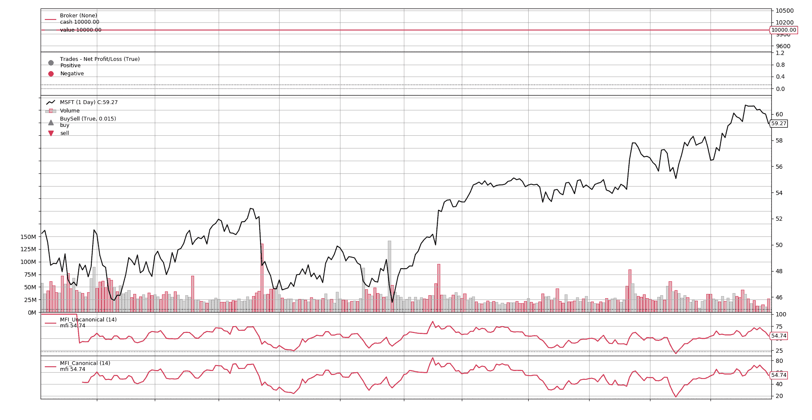
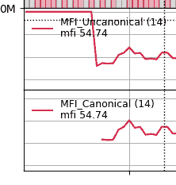

# 规范指标与非规范指标

> 原文： [https://www.backtrader.com/blog/2019-07-08-canonical-or-not/canonical-or-not/](https://www.backtrader.com/blog/2019-07-08-canonical-or-not/canonical-or-not/)

这个问题或多或少地出现了好几次：

*   *反向交易者*如何最好地/规范地实现这个或那个？

*backtrader*的目标之一是**灵活**支持尽可能多的情况和用例，答案很简单：“至少有两种方式”。针对指标进行总结，最常出现的问题是：

*   `__init__`方法中的 100%声明性

*   在`next`方法中 100%逐步

*   对于声明性部分无法覆盖所有所需计算的复杂场景，混合上述两种方法

快速查看*backtrader*中的内置指标可以发现，它们都是以*声明性*方式实现的。原因

1.  容易做

2.  易读

3.  更优雅

4.  矢量化和基于偶数的实现是自动管理的

## 什么自动实现的矢量化？？

对如果指示器完全在`__init_`方法中实现，Python 中*元类*和运算符重载的魔力将带来以下结果

*   矢量化实现（运行回测时的默认设置）

*   基于事件的实现（例如，实时交易）

另一方面，如果在`next`方法中实施的指标的任何部分：

*   这是直接用于基于事件的运行的代码。

*   通过在后台为每个数据点调用`next`方法模拟矢量化

    笔记

    这意味着，即使某个特定指标没有矢量化的实现，所有其他指标都将运行矢量化的实现

## 货币流量指数：一个例子

社区用户*[@Rodrigo Brito](https://community.backtrader.com/user/rodrigo-brito)*发布了一个版本的*“资金流指数*”指标，该指标采用`next`方法实施。

代码

<input name="__tabs_1" type="radio" id="__tab_1_0" checked="checked"> <label for="__tab_1_0">Non Canonical MFI Implementation</label>

```py
class MFI(bt.Indicator):
    lines = ('mfi', 'money_flow_raw', 'typical', 'money_flow_pos', 'money_flow_neg')

    plotlines = dict(
        money_flow_raw=dict(_plotskip=True),
        money_flow_pos=dict(_plotskip=True),
        money_flow_neg=dict(_plotskip=True),
        typical=dict(_plotskip=True),
    )

    params = (
        ('period', 14),
    )

    def next(self):
        typical_price = (self.data.close[0] + self.data.low[0] + self.data.high[0]) / 3
        money_flow_raw = typical_price * self.data.volume[0]

        self.lines.typical[0] = typical_price
        self.lines.money_flow_raw[0] = money_flow_raw

        self.lines.money_flow_pos[0] = money_flow_raw if self.lines.typical[0] >= self.lines.typical[-1] else 0
        self.lines.money_flow_neg[0] = money_flow_raw if self.lines.typical[0] <= self.lines.typical[-1] else 0

        pos_period = math.fsum(self.lines.money_flow_pos.get(size=self.p.period))
        neg_period = math.fsum(self.lines.money_flow_neg.get(size=self.p.period))

        if neg_period == 0:
            self.lines.mfi[0] = 100
            return

        self.lines.mfi[0] =  100 - 100 / (1 +  pos_period / neg_period) 
```

笔记

保持原样，包括必须水平滚动的长线

*[@Rodrigo Brito](https://community.backtrader.com/user/rodrigo-brito)*已经注意到临时行的使用（除`mfi`之外的所有行）可能允许优化。事实上，但以作者的拙见*，事实上每件事都承认有点优化。

为了有共同的工作基础，可以使用*股票图表*中的*“资金流指数”*定义，看看上面的实现是好的。以下是链接：

*   [https://school.stockcharts.com/doku.php?id=technical_indicators:money_flow_index_mfi](https://school.stockcharts.com/doku.php?id=technical_indicators:money_flow_index_mfi)

有了这一点，`MFI`指标的快速**规范**实现

<input name="__tabs_2" type="radio" id="__tab_2_0" checked="checked"> <label for="__tab_2_0">Canonical MFI Implementation</label>

```py
class MFI_Canonical(bt.Indicator):
    lines = ('mfi',)
    params = dict(period=14)

    def __init__(self):
        tprice = (self.data.close + self.data.low + self.data.high) / 3.0
        mfraw = tprice * self.data.volume

        flowpos = bt.ind.SumN(mfraw * (tprice > tprice(-1)), period=self.p.period)
        flowneg = bt.ind.SumN(mfraw * (tprice < tprice(-1)), period=self.p.period)

        mfiratio = bt.ind.DivByZero(flowpos, flowneg, zero=100.0)
        self.l.mfi = 100.0 - 100.0 / (1.0 + mfiratio) 
```

人们应该能够立即注意到

*   定义了一行`mfi`。那里没有临时人员。

*   事情看起来更干净，不需要`[0]`数组索引

*   这里或那里没有单身`if`

*   更紧凑，同时更具可读性

如果其中一个绘制了两个运行在同一数据集上的图形，它将如下所示

[](../mfi.png)

图表显示，除了在开头的**之外，*规范的*和*非规范的*版本都显示了相同的价值和发展。**

*   *非规范*版本从一开始就在传递价值

*   它提供了无意义的价值（100.0，直到它提供了 1 个额外的价值，这也是不好的），因为它不能正确地提供

相反：

*   *标准*版本在达到**最小预热期**后自动开始传递值。

*   不需要人工干预（必须是*“人工智能”*或*“机器学习”*、**双关语**）

请参见受影响区域的特写图片

[](../mfi-start-closeup.png)

笔记

当然，在*非规范*版本中，人们可以通过这样做来缓解这种情况：

*   从已经有一个`period`参数并且知道如何处理它的`bt.ind.PeriodN`子类化（并在`__init__`期间调用`super`）

还要注意的是，*规范的*版本也说明了这一点，就像公式中可能的*除以零*的情况的逐步`next`代码一样。

<input name="__tabs_3" type="radio" id="__tab_3_0" checked="checked"> <label for="__tab_3_0">Non Canonical Division By Zero Handling</label>

```py
 if neg_period == 0:
            self.lines.mfi[0] = 100
            return

        self.lines.mfi[0] =  100 - 100 / (1 +  pos_period / neg_period) 
```

而这是另一种方法

<input name="__tabs_4" type="radio" id="__tab_4_0" checked="checked"> <label for="__tab_4_0">Canonical Division By Zero Handling</label>

```py
 mfiratio = bt.ind.DivByZero(flowpos, flowneg, zero=100.0)
        self.l.mfi = 100.0 - 100.0 / (1.0 + mfiratio) 
```

对于输出*行*，没有多行、`return`语句和不同的赋值，而是对`mfiratio`计算进行了一次声明，并对输出行`mfi`进行了一次赋值（遵循*股票图表*公式）。

## 结论

希望这能让我们了解在*规范的*（即`__init_`中的*声明性*或*非规范的*方式（逐步使用`next`中的数组索引）中实现某些内容时可能存在的差异