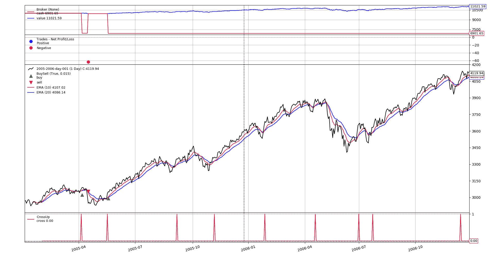
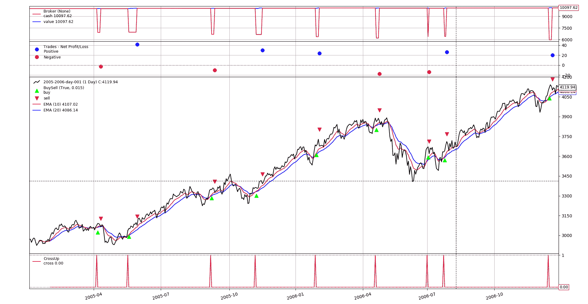
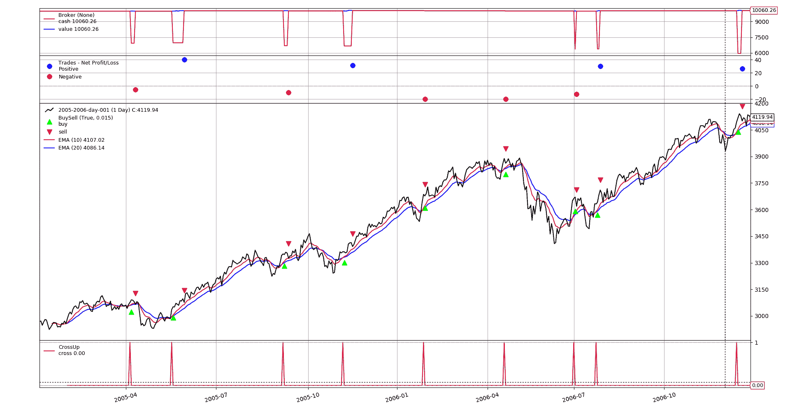
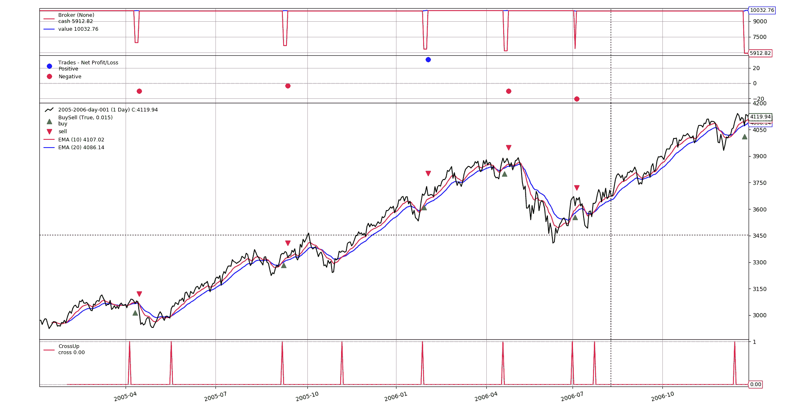

# 停止交易

> 原文： [https://www.backtrader.com/blog/posts/2018-02-01-stop-trading/stop-trading/](https://www.backtrader.com/blog/posts/2018-02-01-stop-trading/stop-trading/)

交易可能是危险的，使用止损单交易有助于避免巨额亏损或确保利润。*反向交易者*为您提供了几种机制来实施基于*停止*的策略

## 基本策略

将使用经典的`Fast EMA`交叉`Slow EMA`方法。但是：

*   发出`buy`订单时，只考虑上十字

*   退出市场，即：`sell`将通过`Stop`完成

因此，战略将从这个简单的框架开始

```py
class BaseStrategy(bt.Strategy):
    params = dict(
        fast_ma=10,
        slow_ma=20,
    )

    def __init__(self):
        # omitting a data implies self.datas[0] (aka self.data and self.data0)
        fast_ma = bt.ind.EMA(period=self.p.fast_ma)
        slow_ma = bt.ind.EMA(period=self.p.slow_ma)
        # our entry point
        self.crossup = bt.ind.CrossUp(fast_ma, slow_ma) 
```

使用继承，我们将研究出不同的方法来实现*停止*

### 人工进近

为了避免有太多的方法，我们基本策略的这个子类将允许：

*   或者以低于收购价格的百分比固定`Stop`

*   或者设置动态`StopTrail`，在价格移动时追踪价格（本例中使用点）

```py
class ManualStopOrStopTrail(BaseStrategy):
    params = dict(
        stop_loss=0.02,  # price is 2% less than the entry point
        trail=False,
    )

    def notify_order(self, order):
        if not order.status == order.Completed:
            return  # discard any other notification

        if not self.position:  # we left the market
            print('SELL@price: {:.2f}'.format(order.executed.price))
            return

        # We have entered the market
        print('BUY @price: {:.2f}'.format(order.executed.price))

        if not self.p.trail:
            stop_price = order.executed.price * (1.0 - self.p.stop_loss)
            self.sell(exectype=bt.Order.Stop, price=stop_price)
        else:
            self.sell(exectype=bt.Order.StopTrail, trailamount=self.p.trail)

    def next(self):
        if not self.position and self.crossup > 0:
            # not in the market and signal triggered
            self.buy() 
```

正如您可能看到的，我们为

*   百分比：`stop_loss=0.02`（2%）

*   或`trail=False`，当设置为数值时，将告知策略使用`StopTrail`

有关订单的文档，请参阅：

*   [订单](https://www.backtrader.com/docu/order.html)

*   [订单管理与执行](https://www.backtrader.com/docu/order-creation-execution/order-creation-execution.html)

*   [停轨（限位）](https://www.backtrader.com/docu/order-creation-execution/trail/stoptrail.html)

让我们用一个固定的`Stop`来执行我们的脚本：

```py
$ ./stop-loss-approaches.py manual --plot
BUY @price: 3073.40
SELL@price: 3009.93
BUY @price: 3034.88 
```

图表呢

[](../manual-stop.png)

正如我们看到的：

*   当有上十字交叉时，发出`buy`

*   当此`buy`被通知为`Completed`时，我们发出`Stop`订单，价格比`executed.price`低`stop_loss`个百分点

结果:

*   第一个实例很快就被阻止了

*   但由于样本数据来自趋势市场……因此没有进一步的实例表明价格低于`stop_loss`百分比

让我们使用相同的方法，但应用`StopTrail`顺序：

```py
$ ./stop-loss-approaches.py manual --plot --strat trail=20
BUY @price: 3073.40
SELL@price: 3070.72
BUY @price: 3034.88
SELL@price: 3076.54
BUY @price: 3349.72
SELL@price: 3339.65
BUY @price: 3364.26
SELL@price: 3393.96
BUY @price: 3684.38
SELL@price: 3708.25
BUY @price: 3884.57
SELL@price: 3867.00
BUY @price: 3664.59
SELL@price: 3650.75
BUY @price: 3635.17
SELL@price: 3661.55
BUY @price: 4100.49
SELL@price: 4120.66 
```

图表呢

[](../manual-stoptrail.png)

现在我们看到，与前一种方法相比，这种方法的效率不高。

*   虽然市场正在走向，但价格下降了几倍于`20`点（我们的*轨迹*值）

*   这就把我们带出了市场

*   而且，由于市场正在走向，移动平均线需要时间才能在预期的方向上再次交叉

### 为什么使用`notify_order`？

因为这确保了必须由`Stop`控制的命令已实际执行。在*回溯测试*期间，这可能不是什么大问题，但在现场交易时却是如此。

让我们使用 backtrader 提供的`cheat-on-close`模式来简化回溯测试方法。

```py
class ManualStopOrStopTrailCheat(BaseStrategy):
    params = dict(
        stop_loss=0.02,  # price is 2% less than the entry point
        trail=False,
    )

    def __init__(self):
        super().__init__()
        self.broker.set_coc(True)

    def notify_order(self, order):
        if not order.status == order.Completed:
            return  # discard any other notification

        if not self.position:  # we left the market
            print('SELL@price: {:.2f}'.format(order.executed.price))
            return

        # We have entered the market
        print('BUY @price: {:.2f}'.format(order.executed.price))

    def next(self):
        if not self.position and self.crossup > 0:
            # not in the market and signal triggered
            self.buy()

            if not self.p.trail:
                stop_price = self.data.close[0] * (1.0 - self.p.stop_loss)
                self.sell(exectype=bt.Order.Stop, price=stop_price)
            else:
                self.sell(exectype=bt.Order.StopTrail,
                          trailamount=self.p.trail) 
```

在这种情况下：

*   在策略的`__init__`阶段，经纪人中的`cheat-on-close`模式被激活

*   `StopOrder`在`buy`订单发出后立即发出。这是因为`cheat-on-close`确保它将在不等待下一个条的情况下执行

    请注意，收盘价（`self.data.close[0]`用于止损，因为还没有执行价。我们知道这将是由于`cheat-on-close`的收盘价

*   `notify_order`方法现在纯粹是一种记录方法，它告诉我们什么时候东西被买或卖。

使用`StopTrail`的样本运行：

```py
$ ./stop-loss-approaches.py manualcheat --plot --strat trail=20
BUY @price: 3076.23
SELL@price: 3070.72
BUY @price: 3036.30
SELL@price: 3076.54
BUY @price: 3349.46
SELL@price: 3339.65
BUY @price: 3362.83
SELL@price: 3393.96
SELL@price: 3685.48
SELL@price: 3665.48
SELL@price: 3888.46
SELL@price: 3868.46
BUY @price: 3662.92
SELL@price: 3650.75
BUY @price: 3631.50
SELL@price: 3661.55
BUY @price: 4094.33
SELL@price: 4120.66 
```

图表呢

[](../manual-stoptrail-cheat.png)

请注意：

*   结果非常相似，但与以前不同

    这是因为`cheat-on-close`给策略提供了收盘价（这是不现实的，但可能是一个很好的近似值），而不是下一个可用价格（即下一个开盘价）

## 使方法自动化

如果订单的逻辑可以保存在`next`中，而不必使用`cheat-on-close`，那就太完美了。这是可以做到的！！！

让我们使用

*   *亲子*订单

笔记

这是`Bracket Order`功能的一部分。

参见：[括号订单](https://www.backtrader.com/docu/order-creation-execution/bracket/bracket.html)

```py
class AutoStopOrStopTrail(BaseStrategy):
    params = dict(
        stop_loss=0.02,  # price is 2% less than the entry point
        trail=False,
        buy_limit=False,
    )

    buy_order = None  # default value for a potential buy_order

    def notify_order(self, order):
        if order.status == order.Cancelled:
            print('CANCEL@price: {:.2f} {}'.format(
                order.executed.price, 'buy' if order.isbuy() else 'sell'))
            return

        if not order.status == order.Completed:
            return  # discard any other notification

        if not self.position:  # we left the market
            print('SELL@price: {:.2f}'.format(order.executed.price))
            return

        # We have entered the market
        print('BUY @price: {:.2f}'.format(order.executed.price))

    def next(self):
        if not self.position and self.crossup > 0:
            if self.buy_order:  # something was pending
                self.cancel(self.buy_order)

            # not in the market and signal triggered
            if not self.p.buy_limit:
                self.buy_order = self.buy(transmit=False)
            else:
                price = self.data.close[0] * (1.0 - self.p.buy_limit)

                # transmit = False ... await child order before transmission
                self.buy_order = self.buy(price=price, exectype=bt.Order.Limit,
                                          transmit=False)

            # Setting parent=buy_order ... sends both together
            if not self.p.trail:
                stop_price = self.data.close[0] * (1.0 - self.p.stop_loss)
                self.sell(exectype=bt.Order.Stop, price=stop_price,
                          parent=self.buy_order)
            else:
                self.sell(exectype=bt.Order.StopTrail,
                          trailamount=self.p.trail,
                          parent=self.buy_order) 
```

这一新战略仍然建立在`BaseStrategy`的基础上，其作用是：

*   添加将`buy`订单发布为`Limit`订单的可能性

    参数`buy_limit`（非`False`时）为当前价格的一个百分比，用于设置预期购买点。

*   为`buy`订单设置`transmit=False`。这意味着订单不会立即发送给经纪人。它将等待来自*子*订单的传输信号

*   立即使用`parent=buy_order`发出*子*指令

    *   这将触发将两个订单发送给经纪人

    *   当父订单执行完毕后，会标记*子*订单进行**调度。**

    在`buy`订单到位之前，不存在`Stop`订单执行的风险。

    *   如果父订单被取消，子订单也将被取消
*   作为一个样本和趋势市场，`Limit`订单可能永远不会执行，并且在收到新信号时仍然有效。在这种情况下，样品将简单地取消待定的`buy`订单，并以当前价格水平继续执行新订单。

    如上所述，这将取消儿童`Stop`订单。

*   取消的订单将被记录

让我们试着在当前收盘价下方以`trail=30`买入`0.5%`

使用`StopTrail`的样本运行：

```py
$ ./stop-loss-approaches.py auto --plot --strat trail=30,buy_limit=0.005
BUY @price: 3060.85
SELL@price: 3050.54
CANCEL@price: 0.00 buy
CANCEL@price: 0.00 sell
BUY @price: 3332.71
SELL@price: 3329.65
CANCEL@price: 0.00 buy
CANCEL@price: 0.00 sell
BUY @price: 3667.05
SELL@price: 3698.25
BUY @price: 3869.02
SELL@price: 3858.46
BUY @price: 3644.61
SELL@price: 3624.02
CANCEL@price: 0.00 buy
CANCEL@price: 0.00 sell
BUY @price: 4073.86 
```

图表呢

[](../auto-stop-trail.png)

日志和图表上的*买入/卖出*标志表明，没有执行任何`sell`订单，但没有相应的`buy`订单，并且取消了`buy`订单，紧接着取消了子`sell`订单（没有任何手动编码）

## 结论

已经展示了如何使用不同的方法进行止损交易。这可以用来避免损失或确保利润。

注意：如果止损点设置在正常的价格变动范围内，非常紧的止损单也可能会使你的头寸脱离市场。

## 脚本使用

```py
$ ./stop-loss-approaches.py --help
usage: stop-loss-approaches.py [-h] [--data0 DATA0] [--fromdate FROMDATE]
                               [--todate TODATE] [--cerebro kwargs]
                               [--broker kwargs] [--sizer kwargs]
                               [--strat kwargs] [--plot [kwargs]]
                               {manual,manualcheat,auto}

Stop-Loss Approaches

positional arguments:
  {manual,manualcheat,auto}
                        Stop approach to use

optional arguments:
  -h, --help            show this help message and exit
  --data0 DATA0         Data to read in (default:
                        ../../datas/2005-2006-day-001.txt)
  --fromdate FROMDATE   Date[time] in YYYY-MM-DD[THH:MM:SS] format (default: )
  --todate TODATE       Date[time] in YYYY-MM-DD[THH:MM:SS] format (default: )
  --cerebro kwargs      kwargs in key=value format (default: )
  --broker kwargs       kwargs in key=value format (default: )
  --sizer kwargs        kwargs in key=value format (default: )
  --strat kwargs        kwargs in key=value format (default: )
  --plot [kwargs]       kwargs in key=value format (default: ) 
```

## 代码

```py
from __future__ import (absolute_import, division, print_function,
                        unicode_literals)

import argparse
import datetime

import backtrader as bt

class BaseStrategy(bt.Strategy):
    params = dict(
        fast_ma=10,
        slow_ma=20,
    )

    def __init__(self):
        # omitting a data implies self.datas[0] (aka self.data and self.data0)
        fast_ma = bt.ind.EMA(period=self.p.fast_ma)
        slow_ma = bt.ind.EMA(period=self.p.slow_ma)
        # our entry point
        self.crossup = bt.ind.CrossUp(fast_ma, slow_ma)

class ManualStopOrStopTrail(BaseStrategy):
    params = dict(
        stop_loss=0.02,  # price is 2% less than the entry point
        trail=False,
    )

    def notify_order(self, order):
        if not order.status == order.Completed:
            return  # discard any other notification

        if not self.position:  # we left the market
            print('SELL@price: {:.2f}'.format(order.executed.price))
            return

        # We have entered the market
        print('BUY @price: {:.2f}'.format(order.executed.price))

        if not self.p.trail:
            stop_price = order.executed.price * (1.0 - self.p.stop_loss)
            self.sell(exectype=bt.Order.Stop, price=stop_price)
        else:
            self.sell(exectype=bt.Order.StopTrail, trailamount=self.p.trail)

    def next(self):
        if not self.position and self.crossup > 0:
            # not in the market and signal triggered
            self.buy()

class ManualStopOrStopTrailCheat(BaseStrategy):
    params = dict(
        stop_loss=0.02,  # price is 2% less than the entry point
        trail=False,
    )

    def __init__(self):
        super().__init__()
        self.broker.set_coc(True)

    def notify_order(self, order):
        if not order.status == order.Completed:
            return  # discard any other notification

        if not self.position:  # we left the market
            print('SELL@price: {:.2f}'.format(order.executed.price))
            return

        # We have entered the market
        print('BUY @price: {:.2f}'.format(order.executed.price))

    def next(self):
        if not self.position and self.crossup > 0:
            # not in the market and signal triggered
            self.buy()

            if not self.p.trail:
                stop_price = self.data.close[0] * (1.0 - self.p.stop_loss)
                self.sell(exectype=bt.Order.Stop, price=stop_price)
            else:
                self.sell(exectype=bt.Order.StopTrail,
                          trailamount=self.p.trail)

class AutoStopOrStopTrail(BaseStrategy):
    params = dict(
        stop_loss=0.02,  # price is 2% less than the entry point
        trail=False,
        buy_limit=False,
    )

    buy_order = None  # default value for a potential buy_order

    def notify_order(self, order):
        if order.status == order.Cancelled:
            print('CANCEL@price: {:.2f} {}'.format(
                order.executed.price, 'buy' if order.isbuy() else 'sell'))
            return

        if not order.status == order.Completed:
            return  # discard any other notification

        if not self.position:  # we left the market
            print('SELL@price: {:.2f}'.format(order.executed.price))
            return

        # We have entered the market
        print('BUY @price: {:.2f}'.format(order.executed.price))

    def next(self):
        if not self.position and self.crossup > 0:
            if self.buy_order:  # something was pending
                self.cancel(self.buy_order)

            # not in the market and signal triggered
            if not self.p.buy_limit:
                self.buy_order = self.buy(transmit=False)
            else:
                price = self.data.close[0] * (1.0 - self.p.buy_limit)

                # transmit = False ... await child order before transmission
                self.buy_order = self.buy(price=price, exectype=bt.Order.Limit,
                                          transmit=False)

            # Setting parent=buy_order ... sends both together
            if not self.p.trail:
                stop_price = self.data.close[0] * (1.0 - self.p.stop_loss)
                self.sell(exectype=bt.Order.Stop, price=stop_price,
                          parent=self.buy_order)
            else:
                self.sell(exectype=bt.Order.StopTrail,
                          trailamount=self.p.trail,
                          parent=self.buy_order)

APPROACHES = dict(
    manual=ManualStopOrStopTrail,
    manualcheat=ManualStopOrStopTrailCheat,
    auto=AutoStopOrStopTrail,
)

def runstrat(args=None):
    args = parse_args(args)

    cerebro = bt.Cerebro()

    # Data feed kwargs
    kwargs = dict()

    # Parse from/to-date
    dtfmt, tmfmt = '%Y-%m-%d', 'T%H:%M:%S'
    for a, d in ((getattr(args, x), x) for x in ['fromdate', 'todate']):
        if a:
            strpfmt = dtfmt + tmfmt * ('T' in a)
            kwargs[d] = datetime.datetime.strptime(a, strpfmt)

    data0 = bt.feeds.BacktraderCSVData(dataname=args.data0, **kwargs)
    cerebro.adddata(data0)

    # Broker
    cerebro.broker = bt.brokers.BackBroker(**eval('dict(' + args.broker + ')'))

    # Sizer
    cerebro.addsizer(bt.sizers.FixedSize, **eval('dict(' + args.sizer + ')'))

    # Strategy
    StClass = APPROACHES[args.approach]
    cerebro.addstrategy(StClass, **eval('dict(' + args.strat + ')'))

    # Execute
    cerebro.run(**eval('dict(' + args.cerebro + ')'))

    if args.plot:  # Plot if requested to
        cerebro.plot(**eval('dict(' + args.plot + ')'))

def parse_args(pargs=None):
    parser = argparse.ArgumentParser(
        formatter_class=argparse.ArgumentDefaultsHelpFormatter,
        description=(
            'Stop-Loss Approaches'
        )
    )

    parser.add_argument('--data0', default='../../datas/2005-2006-day-001.txt',
                        required=False, help='Data to read in')

    # Strategy to choose
    parser.add_argument('approach', choices=APPROACHES.keys(),
                        help='Stop approach to use')

    # Defaults for dates
    parser.add_argument('--fromdate', required=False, default='',
                        help='Date[time] in YYYY-MM-DD[THH:MM:SS] format')

    parser.add_argument('--todate', required=False, default='',
                        help='Date[time] in YYYY-MM-DD[THH:MM:SS] format')

    parser.add_argument('--cerebro', required=False, default='',
                        metavar='kwargs', help='kwargs in key=value format')

    parser.add_argument('--broker', required=False, default='',
                        metavar='kwargs', help='kwargs in key=value format')

    parser.add_argument('--sizer', required=False, default='',
                        metavar='kwargs', help='kwargs in key=value format')

    parser.add_argument('--strat', required=False, default='',
                        metavar='kwargs', help='kwargs in key=value format')

    parser.add_argument('--plot', required=False, default='',
                        nargs='?', const='{}',
                        metavar='kwargs', help='kwargs in key=value format')

    return parser.parse_args(pargs)

if __name__ == '__main__':
    runstrat() 
```