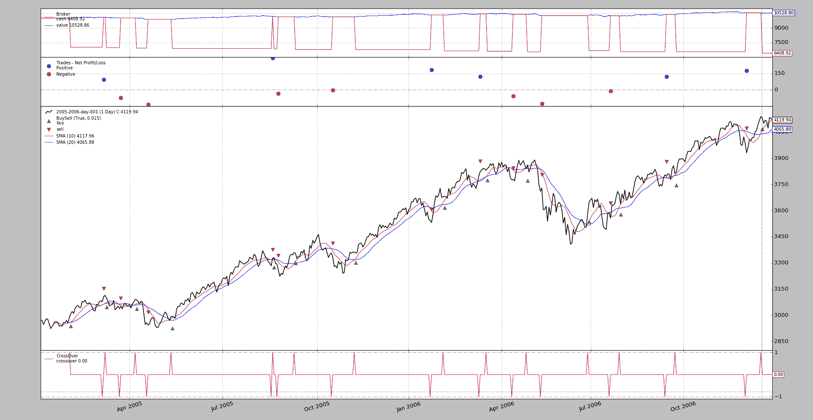
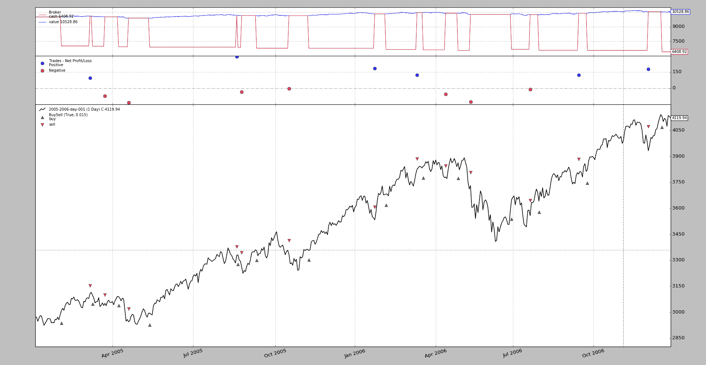

# 评估外部历史绩效

> 原文： [https://www.backtrader.com/blog/posts/2017-07-05-order-history/order-history/](https://www.backtrader.com/blog/posts/2017-07-05-order-history/order-history/)

通过发布`1.9.55.122`，现在可以使用*backtrader*来评估外部订单集的性能。这可用于以下情况，例如：

*   评估使用判断交易（即：人的自由裁量决定）的一组订单/交易

*   评估在另一个平台中创建的订单，并验证该平台的分析器

*   显然是在另一个方向，根据其他平台的知名结果评估*backtrader*返回的东西

## 使用模式

```py
...
cerebro.adddata(mydata)
...
cerebro.add_order_history(orders, notify=True or False)
...
cerebro.run() 
```

这里显而易见的问题是`orders`应该是什么样子。让我们引用以下文档：

*   `orders`：是一个 iterable（例如：list、tuple、iterator、generator），其中每个元素也将是一个 iterable（具有长度），具有以下子元素（可能有两种格式）

    `[datetime, size, price]`或`[datetime, size, price, data]`

    **注**：必须按

    ```py
    datetime ascending 
    ```

    哪里：

    *   `datetime`是 python`date/datetime`实例或格式为 YYYY-MM-DD[THH:MM:SS[.us]]的字符串，括号中的元素是可选的

    *   `size`为整数（正对*买入*，负对*卖出*）

    *   `price`是浮点/整数

    *   `data`如果存在，可采用以下任一值

        *   *无*-1<sup>st</sup>数据馈送将用作目标

        *   *整数*-将使用具有该索引的数据（在**大脑**中的插入顺序）

        *   *字符串*-具有该名称的数据（例如分配有`cerebro.addata(data, name=value)`的数据）将成为目标

在`notify`的情况下：

*   `notify`（默认为*真*

    如果`True`系统中插入的 1<sup>st</sup>策略将根据`orders`中每个订单的信息通知创建的人工订单

笔记

注意上面的例子是如何添加一个*数据提要*。**是**这是需要的。

订单外观的实际示例

```py
ORDER_HISTORY = (
    ('2005-02-01', 1, 2984.63),
    ('2005-03-04', -1, 3079.93),
    ...
    ('2006-12-18', 1, 4140.99),
) 
```

一个包含 3 个元素的 iterable，可以从*CSV*文件完美加载。

## 一个例子

下面的示例做了两件事：

1.  执行简单的*SMA 交叉*策略

2.  添加执行与*SMA 交叉*策略相同操作的订单历史记录

    在这 2<sup>和</sup>案例中，添加了一个空策略来接收`notify_order`和`notify_trade`上的订单和交易通知

在这两种情况下，都加载了一套*分析仪*（*月*和*年*中的`TimeReturn`和一套`TradeAnalyzer`，它们应该返回相同的值。

## 运行 1:SMA 交叉

```py
$ ./order-history.py --plot --cerebro writer=True 
```

它生成一个图表

[](../no-order-history.png)

以及一些文本输出（为简洁起见，设置了上限）：

```py
Creating Signal Strategy
2005-02-01,1,2984.63
2005-03-04,-1,3079.93
...
2006-12-01,-1,3993.03
profit 177.9000000000001
2006-12-18,1,4140.99
===============================================================================
Cerebro:
...
        - timereturn1:
          ~~~~~~~~~~~~~~~~~~~~~~~~~~~~~~~~~~~~~~~~~~~~~~~~~~~~~~~~~~~~~~~~~~~~~
          - Params:
            - timeframe: 8
            - compression: None
            - _doprenext: True
            - data: None
            - firstopen: True
            - fund: None
          ~~~~~~~~~~~~~~~~~~~~~~~~~~~~~~~~~~~~~~~~~~~~~~~~~~~~~~~~~~~~~~~~~~~~~
          - Analysis:
            - 2005-12-31: 0.03580099999999975
            - 2006-12-31: 0.01649448108275653
        .......................................................................
        - tradeanalyzer:
          - Params: None
          ~~~~~~~~~~~~~~~~~~~~~~~~~~~~~~~~~~~~~~~~~~~~~~~~~~~~~~~~~~~~~~~~~~~~~
          - Analysis:
            """""""""""""""""""""""""""""""""""""""""""""""""""""""""""""""""""
            - total:
              - total: 14
              - open: 1
              - closed: 13
            """""""""""""""""""""""""""""""""""""""""""""""""""""""""""""""""""
            - streak:
              ^^^^^^^^^^^^^^^^^^^^^^^^^^^^^^^^^^^^^^^^^^^^^^^^^^^^^^^^^^^^^^^^^
              - won:
                - current: 2
                - longest: 2
... 
```

## 运行 2：订单历史记录

```py
$ ./order-history.py --plot --cerebro writer=True --order-history 
```

这就产生了一个似乎没有区别的图表

[](../order-history.png)

以及一些文本输出（为简洁起见，再次加上上限）：

```py
Creating Empty Strategy
2005-02-01,1,2984.63
2005-03-04,-1,3079.93
...
        .......................................................................
        - timereturn1:
          ~~~~~~~~~~~~~~~~~~~~~~~~~~~~~~~~~~~~~~~~~~~~~~~~~~~~~~~~~~~~~~~~~~~~~
          - Params:
            - timeframe: 8
            - compression: None
            - _doprenext: True
            - data: None
            - firstopen: True
            - fund: None
          ~~~~~~~~~~~~~~~~~~~~~~~~~~~~~~~~~~~~~~~~~~~~~~~~~~~~~~~~~~~~~~~~~~~~~
          - Analysis:
            - 2005-12-31: 0.03580099999999975
            - 2006-12-31: 0.01649448108275653
        .......................................................................
        - tradeanalyzer:
          - Params: None
          ~~~~~~~~~~~~~~~~~~~~~~~~~~~~~~~~~~~~~~~~~~~~~~~~~~~~~~~~~~~~~~~~~~~~~
          - Analysis:
            """""""""""""""""""""""""""""""""""""""""""""""""""""""""""""""""""
            - total:
              - total: 14
              - open: 1
              - closed: 13
            """""""""""""""""""""""""""""""""""""""""""""""""""""""""""""""""""
            - streak:
              ^^^^^^^^^^^^^^^^^^^^^^^^^^^^^^^^^^^^^^^^^^^^^^^^^^^^^^^^^^^^^^^^^
              - won:
                - current: 2
                - longest: 2
... 
```

并且预期值与参考值匹配。

## 结论

例如，衡量判断交易的绩效可以衡量。这有时与 algotrading 结合使用，在 algotrading 中，algo 生成信号，但人类对信号是否必须转化为实际交易有最终决定权。

## 样本使用

```py
$ ./order-history.py --help
usage: order-history.py [-h] [--data0 DATA0] [--fromdate FROMDATE]
                        [--todate TODATE] [--order-history] [--cerebro kwargs]
                        [--broker kwargs] [--sizer kwargs] [--strat kwargs]
                        [--plot [kwargs]]

Order History Sample

optional arguments:
  -h, --help           show this help message and exit
  --data0 DATA0        Data to read in (default:
                       ../../datas/2005-2006-day-001.txt)
  --fromdate FROMDATE  Date[time] in YYYY-MM-DD[THH:MM:SS] format (default: )
  --todate TODATE      Date[time] in YYYY-MM-DD[THH:MM:SS] format (default: )
  --order-history      use order history (default: False)
  --cerebro kwargs     kwargs in key=value format (default: )
  --broker kwargs      kwargs in key=value format (default: )
  --sizer kwargs       kwargs in key=value format (default: )
  --strat kwargs       kwargs in key=value format (default: )
  --plot [kwargs]      kwargs in key=value format (default: ) 
```

## 示例代码

```py
from __future__ import (absolute_import, division, print_function,
                        unicode_literals)

import argparse
import datetime

import backtrader as bt

ORDER_HISTORY = (
    ('2005-02-01', 1, 2984.63),
    ('2005-03-04', -1, 3079.93),
    ('2005-03-08', 1, 3113.82),
    ('2005-03-22', -1, 3040.55),
    ('2005-04-08', 1, 3092.07),
    ('2005-04-20', -1, 2957.92),
    ('2005-05-13', 1, 2991.71),
    ('2005-08-19', -1, 3284.35),
    ('2005-08-22', 1, 3328.84),
    ('2005-08-25', -1, 3293.69),
    ('2005-09-12', 1, 3361.1),
    ('2005-10-18', -1, 3356.73),
    ('2005-11-09', 1, 3361.92),
    ('2006-01-24', -1, 3544.78),
    ('2006-02-06', 1, 3678.87),
    ('2006-03-13', -1, 3801.03),
    ('2006-03-20', 1, 3833.25),
    ('2006-04-13', -1, 3777.24),
    ('2006-05-02', 1, 3839.24),
    ('2006-05-16', -1, 3711.46),
    ('2006-06-30', 1, 3592.01),
    ('2006-07-21', -1, 3580.53),
    ('2006-08-01', 1, 3687.82),
    ('2006-09-14', -1, 3809.08),
    ('2006-09-25', 1, 3815.13),
    ('2006-12-01', -1, 3993.03),
    ('2006-12-18', 1, 4140.99),
)

class SmaCross(bt.SignalStrategy):
    params = dict(sma1=10, sma2=20)

    def notify_order(self, order):
        if not order.alive():
            print(','.join(str(x) for x in
                           (self.data.num2date(order.executed.dt).date(),
                            order.executed.size * 1 if order.isbuy() else -1,
                            order.executed.price)))

    def notify_trade(self, trade):
        if trade.isclosed:
            print('profit {}'.format(trade.pnlcomm))

    def __init__(self):
        print('Creating Signal Strategy')
        sma1 = bt.ind.SMA(period=self.params.sma1)
        sma2 = bt.ind.SMA(period=self.params.sma2)
        crossover = bt.ind.CrossOver(sma1, sma2)
        self.signal_add(bt.SIGNAL_LONG, crossover)

class St(bt.Strategy):
    params = dict(
    )

    def notify_order(self, order):
        if not order.alive():
            print(','.join(str(x) for x in
                           (self.data.num2date(order.executed.dt).date(),
                            order.executed.size * 1 if order.isbuy() else -1,
                            order.executed.price)))

    def notify_trade(self, trade):
        if trade.isclosed:
            print('profit {}'.format(trade.pnlcomm))

    def __init__(self):
        print('Creating Empty Strategy')
        pass

    def next(self):
        pass

def runstrat(args=None):
    args = parse_args(args)

    cerebro = bt.Cerebro()

    # Data feed kwargs
    kwargs = dict()

    # Parse from/to-date
    dtfmt, tmfmt = '%Y-%m-%d', 'T%H:%M:%S'
    for a, d in ((getattr(args, x), x) for x in ['fromdate', 'todate']):
        if a:
            strpfmt = dtfmt + tmfmt * ('T' in a)
            kwargs[d] = datetime.datetime.strptime(a, strpfmt)

    data0 = bt.feeds.BacktraderCSVData(dataname=args.data0, **kwargs)
    cerebro.adddata(data0)

    # Broker
    cerebro.broker = bt.brokers.BackBroker(**eval('dict(' + args.broker + ')'))

    # Sizer
    cerebro.addsizer(bt.sizers.FixedSize, **eval('dict(' + args.sizer + ')'))

    # Strategy
    if not args.order_history:
        cerebro.addstrategy(SmaCross, **eval('dict(' + args.strat + ')'))
    else:
        cerebro.addstrategy(St, **eval('dict(' + args.strat + ')'))
        cerebro.add_order_history(ORDER_HISTORY, notify=True)

    cerebro.addanalyzer(bt.analyzers.TimeReturn, timeframe=bt.TimeFrame.Months)
    cerebro.addanalyzer(bt.analyzers.TimeReturn, timeframe=bt.TimeFrame.Years)
    cerebro.addanalyzer(bt.analyzers.TradeAnalyzer)

    # Execute
    cerebro.run(**eval('dict(' + args.cerebro + ')'))

    if args.plot:  # Plot if requested to
        cerebro.plot(**eval('dict(' + args.plot + ')'))

def parse_args(pargs=None):
    parser = argparse.ArgumentParser(
        formatter_class=argparse.ArgumentDefaultsHelpFormatter,
        description=(
            'Order History Sample'
        )
    )

    parser.add_argument('--data0', default='../../datas/2005-2006-day-001.txt',
                        required=False, help='Data to read in')

    # Defaults for dates
    parser.add_argument('--fromdate', required=False, default='',
                        help='Date[time] in YYYY-MM-DD[THH:MM:SS] format')

    parser.add_argument('--todate', required=False, default='',
                        help='Date[time] in YYYY-MM-DD[THH:MM:SS] format')

    parser.add_argument('--order-history', required=False, action='store_true',
                        help='use order history')

    parser.add_argument('--cerebro', required=False, default='',
                        metavar='kwargs', help='kwargs in key=value format')

    parser.add_argument('--broker', required=False, default='',
                        metavar='kwargs', help='kwargs in key=value format')

    parser.add_argument('--sizer', required=False, default='',
                        metavar='kwargs', help='kwargs in key=value format')

    parser.add_argument('--strat', required=False, default='',
                        metavar='kwargs', help='kwargs in key=value format')

    parser.add_argument('--plot', required=False, default='',
                        nargs='?', const='{}',
                        metavar='kwargs', help='kwargs in key=value format')

    return parser.parse_args(pargs)

if __name__ == '__main__':
    runstrat() 
```