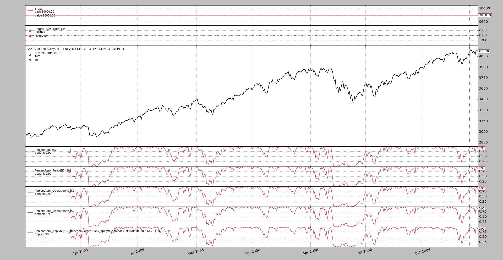

# 百分比重新加载

> 原文： [https://www.backtrader.com/blog/posts/2017-02-05-percentrank-reloaded/percentrank-reloaded/](https://www.backtrader.com/blog/posts/2017-02-05-percentrank-reloaded/percentrank-reloaded/)

社区用户`@randyt`已经能够将*backtrader*扩展到极限。找到一些模糊的角落，甚至在这里和那里添加`pdb`语句，这是获得更精确的重采样流同步的驱动力。

最近，`@randyt`添加了一个 pull 请求，以集成一个名为`PercentRank`的新指示器。这是原始代码

```py
class PercentRank(bt.Indicator):
    lines = ('pctrank',)
    params = (('period', 50),)

    def __init__(self):
        self.addminperiod(self.p.period)

    def next(self):
        self.lines.pctrank[0] = \
            (math.fsum([x < self.data[0]
                       for x in self.data.get(size=self.p.period)])
            / self.p.period)
        super(PercentRank, self).__init__() 
```

它真实地展示了有人是如何进入*backtrader*的源代码的，提出了一些问题，并掌握了一些概念。这真的很好：

```py
self.addminperiod(self.p.period) 
```

出乎意料，因为最终用户甚至不希望知道有人可以在*行*对象中使用该 API 调用。此呼叫告知机器确保指示器至少有*数据馈送*的`self.p.period`样本可用，因为计算需要这些样本。

在原始代码中可以看到一个`self.data.get(size=self.p.period)`，只有在后台引擎在进行 1<sup>st</sup>计算之前确保这些样本可用（并且如果`exactbars`用于减少内存使用，那么这些样本始终存在）时，才会起作用

## 初装

可以对代码进行修改，以利用预先存在的实用程序，这些实用程序旨在缓解开发过程。最终用户不必知道什么，但最好知道是否有人在不断开发或原型化指标。

```py
class PercentRank_PeriodN1(bt.ind.PeriodN):
    lines = ('pctrank',)
    params = (('period', 50),)

    def next(self):
        d0 = self.data[0]  # avoid dict/array lookups each time
        dx = self.data.get(size=self.p.period)
        self.l.pctrank[0] = math.fsum((x < d0 for x in dx)) / self.p.period 
```

重复使用`PeriodN`是移除`self.addminperiod`魔法并使指示器更易于操作的关键。`PeriodN`已经有一个`period`参数，将为用户进行调用（如果`__init__`被覆盖，记得调用`super(cls, self).__init__()`。

计算分为 3 行，首先缓存字典和数组查找，并使其更可读（尽管后者只是一个品味问题）

代码也从 13 行减少到了 8 行。这通常有助于阅读。

## 通过操作重新加载 n

像`SumN`这样的现有指标是对一段时间内数据源的值求和，它不是直接建立在上述`PeriodN`的基础上，而是建立在其名为`OperationN`的子类上。与其父类一样，它仍然没有定义*行*，并且有一个名为`func`的类属性。

将使用一个数组调用`func`，该数组包含主机函数必须操作的时间段的数据。签名基本上是：`func(data[0:period])`并返回适合存储在*行*中的内容，即：浮点值。

知道了这一点，我们可以尝试显而易见的方法

```py
class PercentRank_OperationN1(bt.ind.OperationN):
    lines = ('pctrank',)
    params = (('period', 50),)
    func = (lambda d: math.fsum((x < d[-1] for x in d)) / self.p.period) 
```

最多 4 行。但这将失败（只需要最后一行）：

```py
TypeError: <lambda>() takes 1 positional argument but 2 were given 
```

（使用`--strat n1=True`使样本失败）

通过将我们未命名的函数放入`func`中，它似乎变成了一个方法，因为它包含两个参数。这可以很快治愈。

```py
class PercentRank_OperationN2(bt.ind.OperationN):
    lines = ('pctrank',)
    params = (('period', 50),)
    func = (lambda self, d: math.fsum((x < d[-1] for x in d)) / self.p.period) 
```

它是有效的。但有一点很难看：这不是人们在大多数情况下期望传递函数的方式，即：将`self`作为参数。在这种情况下，我们可以控制函数，但情况可能并不总是这样（需要一个包装器来处理它）

Python 中的语法糖是通过`staticmethod`解救出来的，但在我们这样做之前，我们知道`staticmethod`中不再可能引用`self.p.period`，失去了像以前一样进行平均计算的能力。

但由于`func`接收到一个固定长度的 iterable，所以可以使用`len`。

现在是新代码。

```py
class PercentRank_OperationN3(bt.ind.OperationN):
    lines = ('pctrank',)
    params = (('period', 50),)
    func = staticmethod(lambda d: math.fsum((x < d[-1] for x in d)) / len(d)) 
```

这一切都很好，但这也让我们思考了为什么以前没有考虑过让用户有机会传递他们自己的功能。子类化`OperationN`是一个很好的选择，但更好的方法可能即将出现，避免使用`staticmethod`或将`self`作为参数，并基于*backtrader*中的机制。

让我们定义一个方便的子类`OperationN`。

```py
class ApplyN(bt.ind.OperationN):
    lines = ('apply',)
    params = (('func', None),)

    def __init__(self):
        self.func = self.p.func
        super(ApplyN, self).__init__() 
```

这可能早就在平台上了。这里唯一真正的区别是`lines = ('apply',)`必须存在，或者用户可以自由定义该行和其他行。整合前要考虑的事情。

有了`ApplyN`在手，`PercentRank`的最终版本完全符合我们的预期。首先，版本采用手工平均计算。

```py
class PercentRank_ApplyN(ApplyN):
    params = (
        ('period', 50),
        ('func', lambda d: math.fsum((x < d[-1] for x in d)) / len(d)),
    ) 
```

在不破坏`PEP-8`的情况下，我们仍然可以将两者重新格式化，以适应 3 行……很好！

## 让我们运行样本

下面可以看到的示例具有常见的框架样板，但旨在显示不同`PercentRank`实现的视觉比较。

笔记

使用`--strat n1=True`执行，尝试不工作的`PercentRank_OperationN1`版本

图形输出。

[](../percentrank.png)

## 样本使用

```py
$ ./percentrank.py --help
usage: percentrank.py [-h] [--data0 DATA0] [--fromdate FROMDATE]
                      [--todate TODATE] [--cerebro kwargs] [--broker kwargs]
                      [--sizer kwargs] [--strat kwargs] [--plot [kwargs]]

Sample Skeleton

optional arguments:
  -h, --help           show this help message and exit
  --data0 DATA0        Data to read in (default:
                       ../../datas/2005-2006-day-001.txt)
  --fromdate FROMDATE  Date[time] in YYYY-MM-DD[THH:MM:SS] format (default: )
  --todate TODATE      Date[time] in YYYY-MM-DD[THH:MM:SS] format (default: )
  --cerebro kwargs     kwargs in key=value format (default: )
  --broker kwargs      kwargs in key=value format (default: )
  --sizer kwargs       kwargs in key=value format (default: )
  --strat kwargs       kwargs in key=value format (default: )
  --plot [kwargs]      kwargs in key=value format (default: ) 
```

## 示例代码

```py
from __future__ import (absolute_import, division, print_function,
                        unicode_literals)

import argparse
import datetime
import math

import backtrader as bt

class PercentRank(bt.Indicator):
    lines = ('pctrank',)
    params = (('period', 50),)

    def __init__(self):
        self.addminperiod(self.p.period)

    def next(self):
        self.lines.pctrank[0] = \
            (math.fsum([x < self.data[0]
                       for x in self.data.get(size=self.p.period)])
            / self.p.period)
        super(PercentRank, self).__init__()

class PercentRank_PeriodN1(bt.ind.PeriodN):
    lines = ('pctrank',)
    params = (('period', 50),)

    def next(self):
        d0 = self.data[0]  # avoid dict/array lookups each time
        dx = self.data.get(size=self.p.period)
        self.l.pctrank[0] = math.fsum((x < d0 for x in dx)) / self.p.period

class PercentRank_OperationN1(bt.ind.OperationN):
    lines = ('pctrank',)
    params = (('period', 50),)
    func = (lambda d: math.fsum((x < d[-1] for x in d)) / self.p.period)

class PercentRank_OperationN2(bt.ind.OperationN):
    lines = ('pctrank',)
    params = (('period', 50),)
    func = (lambda self, d: math.fsum((x < d[-1] for x in d)) / self.p.period)

class PercentRank_OperationN3(bt.ind.OperationN):
    lines = ('pctrank',)
    params = (('period', 50),)
    func = staticmethod(lambda d: math.fsum((x < d[-1] for x in d)) / len(d))

class ApplyN(bt.ind.OperationN):
    lines = ('apply',)
    params = (('func', None),)

    def __init__(self):
        self.func = self.p.func
        super(ApplyN, self).__init__()

class PercentRank_ApplyN(ApplyN):
    params = (
        ('period', 50),
        ('func', lambda d: math.fsum((x < d[-1] for x in d)) / len(d)),
    )

class St(bt.Strategy):
    params = (
        ('n1', False),
    )

    def __init__(self):
        PercentRank()
        PercentRank_PeriodN1()
        if self.p.n1:
            PercentRank_OperationN1()
        PercentRank_OperationN2()
        PercentRank_OperationN3()
        PercentRank_ApplyN()

    def next(self):
        pass

def runstrat(args=None):
    args = parse_args(args)

    cerebro = bt.Cerebro()

    # Data feed kwargs
    kwargs = dict()

    # Parse from/to-date
    dtfmt, tmfmt = '%Y-%m-%d', 'T%H:%M:%S'
    for a, d in ((getattr(args, x), x) for x in ['fromdate', 'todate']):
        if a:
            strpfmt = dtfmt + tmfmt * ('T' in a)
            kwargs[d] = datetime.datetime.strptime(a, strpfmt)

    # Data feed
    data0 = bt.feeds.BacktraderCSVData(dataname=args.data0, **kwargs)
    cerebro.adddata(data0)

    # Broker
    cerebro.broker = bt.brokers.BackBroker(**eval('dict(' + args.broker + ')'))

    # Sizer
    cerebro.addsizer(bt.sizers.FixedSize, **eval('dict(' + args.sizer + ')'))

    # Strategy
    cerebro.addstrategy(St, **eval('dict(' + args.strat + ')'))

    # Execute
    cerebro.run(**eval('dict(' + args.cerebro + ')'))

    if args.plot:  # Plot if requested to
        cerebro.plot(**eval('dict(' + args.plot + ')'))

def parse_args(pargs=None):
    parser = argparse.ArgumentParser(
        formatter_class=argparse.ArgumentDefaultsHelpFormatter,
        description=(
            'Sample Skeleton'
        )
    )

    parser.add_argument('--data0', default='../../datas/2005-2006-day-001.txt',
                        required=False, help='Data to read in')

    # Defaults for dates
    parser.add_argument('--fromdate', required=False, default='',
                        help='Date[time] in YYYY-MM-DD[THH:MM:SS] format')

    parser.add_argument('--todate', required=False, default='',
                        help='Date[time] in YYYY-MM-DD[THH:MM:SS] format')

    parser.add_argument('--cerebro', required=False, default='',
                        metavar='kwargs', help='kwargs in key=value format')

    parser.add_argument('--broker', required=False, default='',
                        metavar='kwargs', help='kwargs in key=value format')

    parser.add_argument('--sizer', required=False, default='',
                        metavar='kwargs', help='kwargs in key=value format')

    parser.add_argument('--strat', required=False, default='',
                        metavar='kwargs', help='kwargs in key=value format')

    parser.add_argument('--plot', required=False, default='',
                        nargs='?', const='{}',
                        metavar='kwargs', help='kwargs in key=value format')

    return parser.parse_args(pargs)

if __name__ == '__main__':
    runstrat() 
```