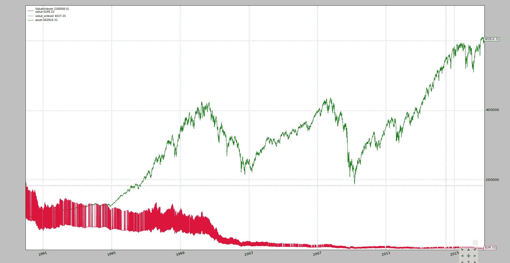
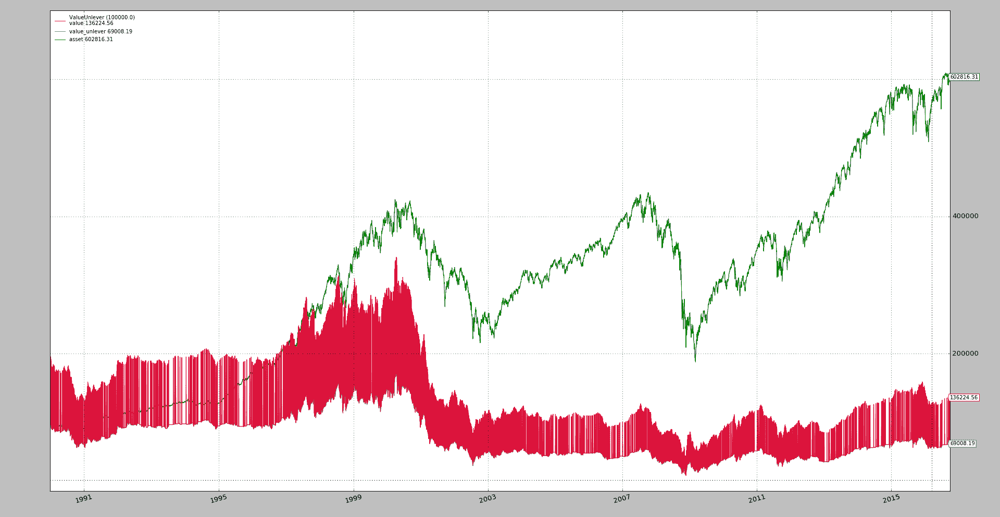
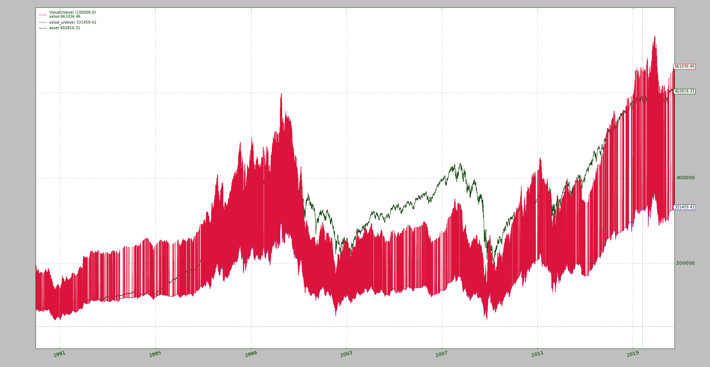

# BTFD-现实点播

> 原文： [https://www.backtrader.com/blog/posts/2016-12-28-btfd-bites/btfd-bites/](https://www.backtrader.com/blog/posts/2016-12-28-btfd-bites/btfd-bites/)

前一篇帖子成功复制了`BTFD`策略，发现真正的收益是`16x`而不是`31x`。

但正如复制过程中指出的：

*   没有收取佣金

*   使用`2x`杠杆不收取利息

这就提出了一个显而易见的问题：

*   *收取佣金和利息时，其中的 16 倍将有多少？*

幸运的是，前面的示例足够灵活，可以对其进行实验。为了获得一些视觉反馈和验证，将在策略中添加以下代码

```py
def start(self):
    print(','.join(['TRADE', 'STATUS', 'Value', 'PNL', 'COMMISSION']))

def notify_order(self, order):
    if order.status in [order.Margin]:
        print('ORDER FAILED with status:', order.getstatusname())

def notify_trade(self, trade):
    if trade.isclosed:
        print(','.join(map(str, [
            'TRADE', 'CLOSE',
            self.data.num2date(trade.dtclose).date().isoformat(),
            trade.value,
            trade.pnl,
            trade.commission,
        ]
        )))
    elif trade.justopened:
        print(','.join(map(str, [
            'TRADE', 'OPEN',
            self.data.num2date(trade.dtopen).date().isoformat(),
            trade.value,
            trade.pnl,
            trade.commission,
        ]
        ))) 
```

这一切都是关于以下方面：

*   了解交易的开盘和收盘方式（价值、损益、价值和佣金）

*   如果订单因资金不足而被`Margin`拒绝，则提供反馈

    笔记

    由于将调整投资金额，为佣金留出空间，一些订单无法被经纪人接受。这种视觉反馈允许识别情况

## 验证

首先，快速测试一些订单是否被接受。

```py
$ ./btfd.py --comminfo commission=0.001,leverage=2.0 --strat target=1.0

TRADE,STATUS,Value,PNL,COMMISSION
ORDER FAILED with status: Margin
ORDER FAILED with status: Margin
TRADE,OPEN,1990-01-08,199345.2,0.0,199.3452
TRADE,CLOSE,1990-01-10,0.0,-1460.28,397.23012 
```

注意:

*   我们采用`target=1.0`，即*尝试投资 100%的资本*。这是默认值，但作为参考。

*   `commission=0.001`或`0.1%`以确保我们有时能够满足保证金要求

*   1<sup>st</sup>两个订单被`Margin`拒绝

*   接受第 3<sup>号</sup>订单。这不是一个错误。系统尝试投资`100%`的资本，但资产有*价格*，用于计算股权规模。*规模*根据实际可用*现金*计算潜在*规模*的实际结果向下舍入。这四舍五入为委员会提供了足够的空间来处理这第 3<sup>条</sup>订单。

*   交易通知（`OPEN`和`CLOSE`显示期初佣金和最终总佣金，其值接近`200k`，显示了`2x`杠杆作用。

    期初佣金为`199.3452`，为杠杆价值的`0.1%`，杠杆价值为`199,345.2`

其余测试将使用`target=0.99x`进行，其中`x`将确保有足够的空间用于选定的调试。

## 现实咬人

让我们来看一些真实的例子

### 目标 99.8%-佣金 0.1%

```py
./btfd.py --comminfo commission=0.001,leverage=2.0 --strat target=0.998 --plot 
```

[](../btfd-commission-001-target-0998.png)

起泡的藤壶！！！不仅是`BTFD`策略与`16x`收益并不接近：**它损失了大部分资金**。

*   从`100,000`下降到大致`4,027`

笔记

*下降到*的值是非杠杆值，因为这是当头寸关闭时系统中返回的近似值

### 目标 99.9%-佣金 0.05%

很可能是委员会过于激进。让我们吃一半吧

```py
./btfd.py --comminfo commission=0.0005,leverage=2.0 --strat target=0.999 --plot 
```

[](../btfd-commission-0005-target-0999.png)

**不，不**。佣金没有那么激进，因为系统仍然亏损，从`100,000`下降到`69,000`左右（非杠杆价值）

### 目标 99.95%-佣金 0.025%

佣金再除以二

```py
./btfd.py --comminfo commission=0.00025,leverage=2.0 --strat target=0.9995 --plot 
```

[](../btfd-commission-00025-target-09995.png)

最后，系统赚钱：

*   初始`100,000`被提升到`331,459`以获得`3x`增益。

*   但这与资产的绩效不匹配，资产的绩效已上升到`600k`以上

笔记

样本接受`--fromdate YYYY-MM-DD`和`--todate YYYY-MM-DD`来选择策略必须应用到哪个时期。这将允许针对不同的日期范围测试类似的场景。

## 结论

当面临佣金时，`16x`收益不成立。对于一些经纪商提供的佣金（不设上限，以%为基础），我们需要一个非常好的交易来确保系统赚钱。

在这种情况下，该策略应用于`S&P500`，则`BTFD`策略与指数的性能不匹配。

未采用*利率*。使用佣金足以看出与任何潜在利润的差距有多大。在任何情况下，利率为`2%`的运行都会像这样执行

```py
./btfd.py --comminfo commission=0.00025,leverage=2.0,interest=0.02,interest_long=True --strat target=0.9995 --plot 
```

需要`interest_long=True`，因为收取利息的默认行为是仅对*空头*头寸收取利息

## 样本使用

```py
$ ./btfd.py --help
usage: btfd.py [-h] [--offline] [--data TICKER]
               [--fromdate YYYY-MM-DD[THH:MM:SS]]
               [--todate YYYY-MM-DD[THH:MM:SS]] [--cerebro kwargs]
               [--broker kwargs] [--valobserver kwargs] [--strat kwargs]
               [--comminfo kwargs] [--plot [kwargs]]

BTFD - http://dark-bid.com/BTFD-only-strategy-that-matters.html - https://www.
reddit.com/r/algotrading/comments/5jez2b/can_anyone_replicate_this_strategy/

optional arguments:
  -h, --help            show this help message and exit
  --offline             Use offline file with ticker name (default: False)
  --data TICKER         Yahoo ticker to download (default: ^GSPC)
  --fromdate YYYY-MM-DD[THH:MM:SS]
                        Starting date[time] (default: 1990-01-01)
  --todate YYYY-MM-DD[THH:MM:SS]
                        Ending date[time] (default: 2016-10-01)
  --cerebro kwargs      kwargs in key=value format (default: stdstats=False)
  --broker kwargs       kwargs in key=value format (default: cash=100000.0,
                        coc=True)
  --valobserver kwargs  kwargs in key=value format (default:
                        assetstart=100000.0)
  --strat kwargs        kwargs in key=value format (default:
                        approach="highlow")
  --comminfo kwargs     kwargs in key=value format (default: leverage=2.0)
  --plot [kwargs]       kwargs in key=value format (default: ) 
```

## 示例代码

```py
from __future__ import (absolute_import, division, print_function,
                        unicode_literals)

# References:
#  - https://www.reddit.com/r/algotrading/comments/5jez2b/can_anyone_replicate_this_strategy/
#  - http://dark-bid.com/BTFD-only-strategy-that-matters.html

import argparse
import datetime

import backtrader as bt

class ValueUnlever(bt.observers.Value):
    '''Extension of regular Value observer to add leveraged view'''
    lines = ('value_lever', 'asset')
    params = (('assetstart', 100000.0), ('lever', True),)

    def next(self):
        super(ValueUnlever, self).next()
        if self.p.lever:
            self.lines.value_lever[0] = self._owner.broker._valuelever

        if len(self) == 1:
            self.lines.asset[0] = self.p.assetstart
        else:
            change = self.data[0] / self.data[-1]
            self.lines.asset[0] = change * self.lines.asset[-1]

class St(bt.Strategy):
    params = (
        ('fall', -0.01),
        ('hold', 2),
        ('approach', 'highlow'),
        ('target', 1.0)
    )

    def __init__(self):
        if self.p.approach == 'closeclose':
            self.pctdown = self.data.close / self.data.close(-1) - 1.0
        elif self.p.approach == 'openclose':
            self.pctdown = self.data.close / self.data.open - 1.0
        elif self.p.approach == 'highclose':
            self.pctdown = self.data.close / self.data.high - 1.0
        elif self.p.approach == 'highlow':
            self.pctdown = self.data.low / self.data.high - 1.0

    def next(self):
        if self.position:
            if len(self) == self.barexit:
                self.close()
        else:
            if self.pctdown <= self.p.fall:
                self.order_target_percent(target=self.p.target)
                self.barexit = len(self) + self.p.hold

    def start(self):
        print(','.join(['TRADE', 'STATUS', 'Value', 'PNL', 'COMMISSION']))

    def notify_order(self, order):
        if order.status in [order.Margin, order.Rejected, order.Canceled]:
            print('ORDER FAILED with status:', order.getstatusname())

    def notify_trade(self, trade):
        if trade.isclosed:
            print(','.join(map(str, [
                'TRADE', 'CLOSE',
                self.data.num2date(trade.dtclose).date().isoformat(),
                trade.value,
                trade.pnl,
                trade.commission,
            ]
            )))
        elif trade.justopened:
            print(','.join(map(str, [
                'TRADE', 'OPEN',
                self.data.num2date(trade.dtopen).date().isoformat(),
                trade.value,
                trade.pnl,
                trade.commission,
            ]
            )))

def runstrat(args=None):
    args = parse_args(args)

    cerebro = bt.Cerebro()

    # Data feed kwargs
    kwargs = dict()

    # Parse from/to-date
    dtfmt, tmfmt = '%Y-%m-%d', 'T%H:%M:%S'
    for a, d in ((getattr(args, x), x) for x in ['fromdate', 'todate']):
        kwargs[d] = datetime.datetime.strptime(a, dtfmt + tmfmt * ('T' in a))

    if not args.offline:
        YahooData = bt.feeds.YahooFinanceData
    else:
        YahooData = bt.feeds.YahooFinanceCSVData

    # Data feed - no plot - observer will do the job
    data = YahooData(dataname=args.data, plot=False, **kwargs)
    cerebro.adddata(data)

    # Broker
    cerebro.broker = bt.brokers.BackBroker(**eval('dict(' + args.broker + ')'))

    # Add a commission
    cerebro.broker.setcommission(**eval('dict(' + args.comminfo + ')'))

    # Strategy
    cerebro.addstrategy(St, **eval('dict(' + args.strat + ')'))

    # Add specific observer
    cerebro.addobserver(ValueUnlever, **eval('dict(' + args.valobserver + ')'))

    # Execute
    cerebro.run(**eval('dict(' + args.cerebro + ')'))

    if args.plot:  # Plot if requested to
        cerebro.plot(**eval('dict(' + args.plot + ')'))

def parse_args(pargs=None):
    parser = argparse.ArgumentParser(
        formatter_class=argparse.ArgumentDefaultsHelpFormatter,
        description=(' - '.join([
            'BTFD',
            'http://dark-bid.com/BTFD-only-strategy-that-matters.html',
            ('https://www.reddit.com/r/algotrading/comments/5jez2b/'
             'can_anyone_replicate_this_strategy/')]))
        )

    parser.add_argument('--offline', required=False, action='store_true',
                        help='Use offline file with ticker name')

    parser.add_argument('--data', required=False, default='^GSPC',
                        metavar='TICKER', help='Yahoo ticker to download')

    parser.add_argument('--fromdate', required=False, default='1990-01-01',
                        metavar='YYYY-MM-DD[THH:MM:SS]',
                        help='Starting date[time]')

    parser.add_argument('--todate', required=False, default='2016-10-01',
                        metavar='YYYY-MM-DD[THH:MM:SS]',
                        help='Ending date[time]')

    parser.add_argument('--cerebro', required=False, default='stdstats=False',
                        metavar='kwargs', help='kwargs in key=value format')

    parser.add_argument('--broker', required=False,
                        default='cash=100000.0, coc=True',
                        metavar='kwargs', help='kwargs in key=value format')

    parser.add_argument('--valobserver', required=False,
                        default='assetstart=100000.0',
                        metavar='kwargs', help='kwargs in key=value format')

    parser.add_argument('--strat', required=False,
                        default='approach="highlow"',
                        metavar='kwargs', help='kwargs in key=value format')

    parser.add_argument('--comminfo', required=False, default='leverage=2.0',
                        metavar='kwargs', help='kwargs in key=value format')

    parser.add_argument('--plot', required=False, default='',
                        nargs='?', const='volume=False',
                        metavar='kwargs', help='kwargs in key=value format')

    return parser.parse_args(pargs)

if __name__ == '__main__':
    runstrat() 
```