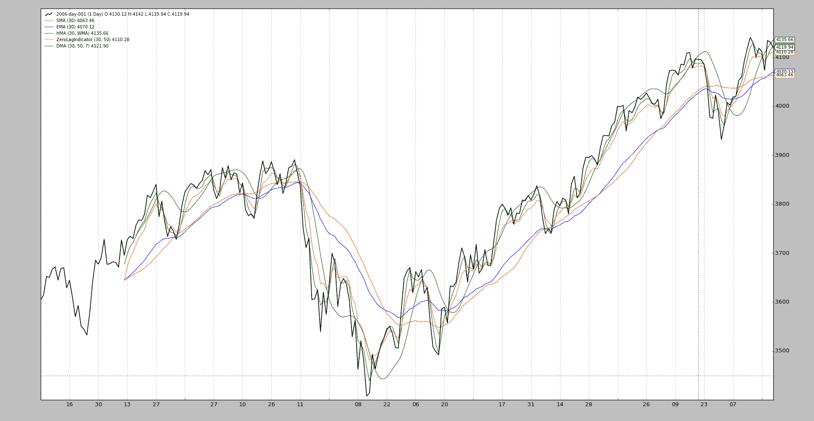
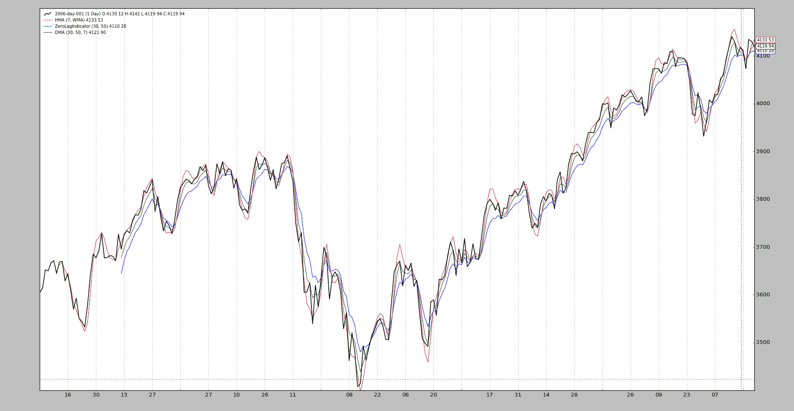

# 迪克森移动平均线

> 原文： [https://www.backtrader.com/blog/posts/2016-08-18-dickson-moving-average/dickson-moving-average/](https://www.backtrader.com/blog/posts/2016-08-18-dickson-moving-average/dickson-moving-average/)

下面的*reddit*帖子以其作者*Nathan Dickson*（*reddit*句柄）命名了这条均线*Dickson 移动均线*

在一次定期访问[reddit Algotrading](https://www.reddit.com/r/algotrading/)的过程中，我发现了一篇关于试图模仿 Jurik 移动平均线（又名*JMA*的移动平均线）的帖子

*   [迪克森移动平均线](https://www.reddit.com/r/algotrading/comments/4xj3vh/dickson_moving_average/)

*   [JMA 关于 Jurik 研究](http://www.jurikres.com/catalog1/ms_ama.htm)

在*EasyLanguage*中被描述为算法，我不得不询问种子值和`ec`的性质，这最终导致*Ehlers*和*零滞后指示器*

*   [零滞后](http://www.mesasoftware.com/papers/ZeroLag.pdf)

为了将*迪克森移动平均线*应用于*反向交易者*，并考虑到对*埃勒斯*和*船体移动平均线*的依赖性，这两种移动平均线也被添加到移动平均线库中。

总之，在`Release 1.8.7.96`中增加了以下内容：

*   `Hull Moving Average`

*   `Zero Lag Indicator`

*   `Dickson Moving Average`

通过使用其中一个样本数据和`btrun`的曲线图可以看到结果：

```py
$ btrun --nostdstats \
    --format btcsv \
    --data ../../../backtrader/datas/2006-day-001.txt \
    --indicator :SMA \
    --indicator :EMA \
    --indicator :HMA \
    --indicator :ZeroLagIndicator \
    --indicator :DMA \
    --plot style=\'line\' 
```

[](../dma-comparison.png)

现在是让迪克森移动平均线产生利润的时候了……就像其他指标一样。

笔记

请注意*船体移动平均线*（又名*HMA*）是如何开始产生比其他值晚几个值的。这是因为 is 在*移动平均线*上使用*移动平均线*，从而延迟了初始生产。

比较显示*DMA*如何位于*零点指示器*和*HullMovingAverage*之间。后者用一个`period=7`匹配*迪克森移动平均线*内的默认值：

```py
$ btrun --nostdstats \
    --format btcsv \
    --data ../../../backtrader/datas/2006-day-001.txt \
    --indicator :HMA:period=7 \
    --indicator :ZeroLagIndicator \
    --indicator :DMA \
    --plot style=\'line\' 
```

[](../dma-hma-zlind-comparison.png)